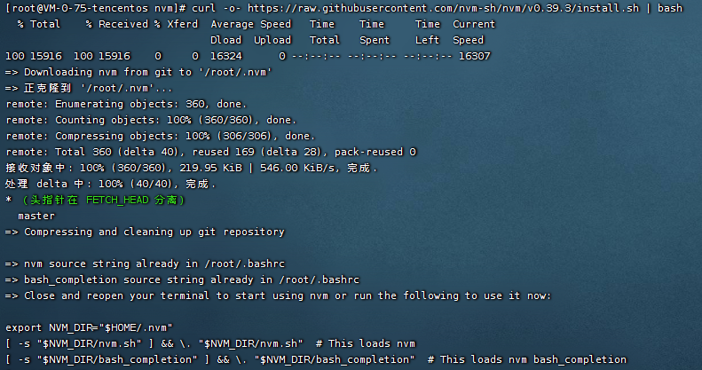

# nvm

nvm（Node.js Version Manager）是一个用于管理 Node.js 版本的工具，可以帮助用户快速切换 Node.js 版本。
通过 nvm，用户可以在同一台计算机同时安装和使用多个不同的 Node.js 版本，并且可以方便地在它们之间进行切换。

> tips: 一定要卸载已安装的 NodeJS，否则会发生冲突。

### 一、Linux 安装

> 可参考 https://github.com/nvm-sh/nvm

#### 方式1

> tips: 个人常用这个方式进行安装，方式2可能会由于网络问题存在资源下载失败的问题...

```shell
wget https://github.com/nvm-sh/nvm/archive/refs/tags/v0.39.3.tar.gz
mkdir /root/.nvm
tar -zxvf v0.39.3.tar.gz --strip-components 1  -C /root/.nvm

# 激活 Node Version Manager (NVM) 的 Shell 脚本  -- [ 临时，重开shell之后就会失效 ]
source ~/.nvm/nvm.sh

# 写入配置 -- [ 永久 ]
cat>> /etc/profile <<EOF

############################## ↓↓↓↓↓↓ set nvm environment ↓↓↓↓↓↓ #############################
export NVM_DIR="$([ -z "${XDG_CONFIG_HOME-}" ] && printf %s "${HOME}/.nvm" || printf %s "${XDG_CONFIG_HOME}/nvm")"
[ -s "$NVM_DIR/nvm.sh" ] && \. "$NVM_DIR/nvm.sh" # This loads nvm
################################################################################################

EOF

# 使配置生效
source /etc/profile

# 验证
nvm -v
```

#### 方式2

```shell
# 安装
curl -o- https://raw.githubusercontent.com/nvm-sh/nvm/v0.39.3/install.sh | bash

# 写入配置
cat>> /etc/profile <<EOF

############################## ↓↓↓↓↓↓ set nvm environment ↓↓↓↓↓↓ #############################
export NVM_DIR="$([ -z "${XDG_CONFIG_HOME-}" ] && printf %s "${HOME}/.nvm" || printf %s "${XDG_CONFIG_HOME}/nvm")"
[ -s "$NVM_DIR/nvm.sh" ] && \. "$NVM_DIR/nvm.sh" # This loads nvm
################################################################################################

EOF

# 使配置生效
source /etc/profile

# 验证
command -v nvm
nvm -v
```



### 二、常用命令 & 安装nodejs

```shell
# 查看版本
nvm -v

# 显示可下载版本的部分列表
nvm list available

# 安装指定版本的 Node.js，例如 nvm install 12.18.3
nvm install 版本号
# 切换到指定版本的 Node.js 环境，例如 nvm use 12.18.3
nvm use 版本号
# 列出当前已经安装的所有 Node.js 版本，其中带有 * 号的表示当前正在使用的版本
nvm ls

# 卸载指定版本的 Node.js。
nvm uninstall 版本号

# 给一个 Node.js 版本设置别名，例如 nvm alias default 14.17.0 将默认版本设置为 14.17.0
nvm alias 别名 版本号
# 通过设置的别名切换到对应版本的 Node.js，例如 nvm use default
nvm use 别名
```

### 三、卸载nvm

```shell
# 删除 nvm 安装目录
rm -rf ~/.nvm

# 取消激活 -- 用于执行过 source ~/.nvm/nvm.sh 命令的情况
unset -f nvm

# 还需要删除 .bashrc 或 .zshrc 等相应的 Shell 配置文件中与 NVM 相关的代码。
# eg: 找到类似下面的配置，删除或注释掉
cat ~/.bashrc
cat /etc/profile

export NVM_DIR="$HOME/.nvm"
[ -s "$NVM_DIR/nvm.sh" ] && \. "$NVM_DIR/nvm.sh"  # This loads nvm
[ -s "$NVM_DIR/bash_completion" ] && \. "$NVM_DIR/bash_completion"  # This loads nvm bash_completion


# 确认是否卸载成功
nvm -v
```
