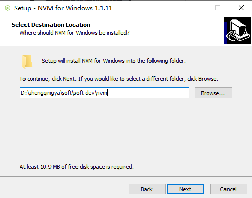
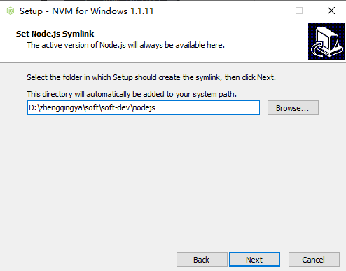
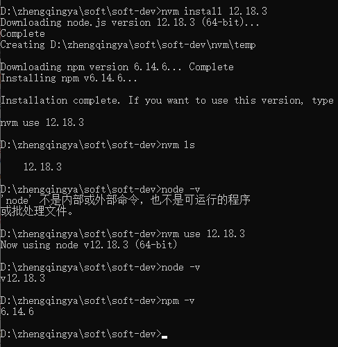

# nvm

nvm（Node.js Version Manager）是一个用于管理 Node.js 版本的工具，可以帮助用户快速切换 Node.js 版本。
通过 nvm，用户可以在同一台计算机同时安装和使用多个不同的 Node.js 版本，并且可以方便地在它们之间进行切换。

> tips: 一定要卸载已安装的 NodeJS，否则会发生冲突。

### 一、windows 安装

下载`nvm-setup.exe` https://github.com/coreybutler/nvm-windows/releases

双击安装



### 二、验证

> [01-nvm常用命令.md](01-nvm常用命令.md)

```shell
# 查看版本
nvm -v
```



### 三、问题

如果nvm执行时操作

```shell
ERROR open \settings.txt: The system cannot find the file specified
```

解决：

检查nvm安装目录下的`settings.txt`配置文件是否配置正确，以及系统环境变量是否正确。

> 如果都正确的情况下，尝试删除此配置文件后重新创建一个新的一样的文件，我就是这样解决的，属实有点坑...

-1718257600325.png)
