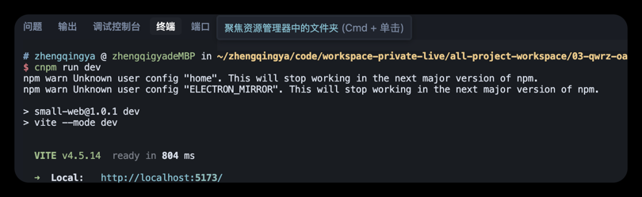
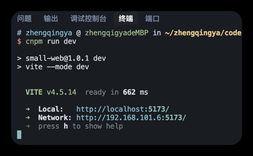

# 常用命令 & 安装nodejs

```shell
# 查看版本
nvm -v

# 显示可下载版本的部分列表
nvm list available

# 安装最新版本
nvm install latest
# 安装指定版本的 Node.js，例如 nvm install 16.18.0
nvm install 版本号
# 切换到指定版本的 Node.js 环境，例如 nvm use 16.18.0
nvm use 版本号
# 列出当前已经安装的所有 Node.js 版本，其中带有 * 号的表示当前正在使用的版本
nvm ls

# 修改npm镜像源为淘宝镜像
# npm config set registry https://registry.npmmirror.com
# 检查是否成功
# npm config get registry

# 卸载指定版本的 Node.js。
nvm uninstall 版本号

# 给一个 Node.js 版本设置别名，例如 nvm alias default 12.18.3 将默认版本设置为 12.18.3
nvm alias 别名 版本号
# 通过设置的别名切换到对应版本的 Node.js，例如 nvm use default
nvm use 别名


# 设置默认版本
nvm alias default 16.18.0
# 设置默认版本为当前使用的版本
nvm alias default $(node -v)
```

### 问题



```shell
nvm install 24.11.0
# 安装高版本后，出现警告如下
# npm warn Unknown user config "home". This will stop working in the next major version of npm.
# npm warn Unknown user config "ELECTRON_MIRROR". This will stop working in the next major version of npm.

# 解决：
# 查看配置项
npm config list
# 移除过时的配置项
npm config delete home
npm config delete ELECTRON_MIRROR
```

最终修复成功：

