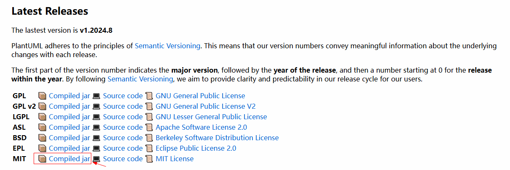
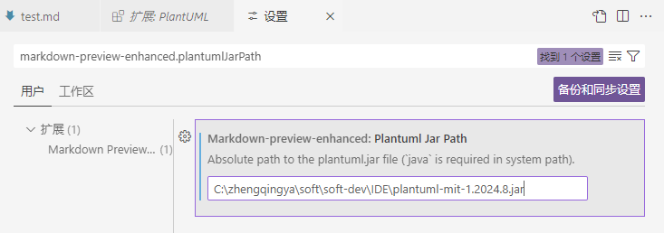
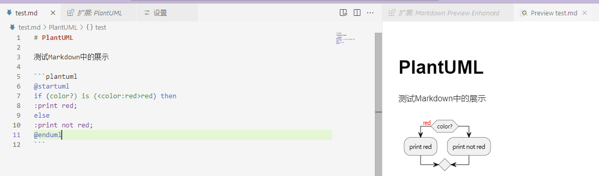
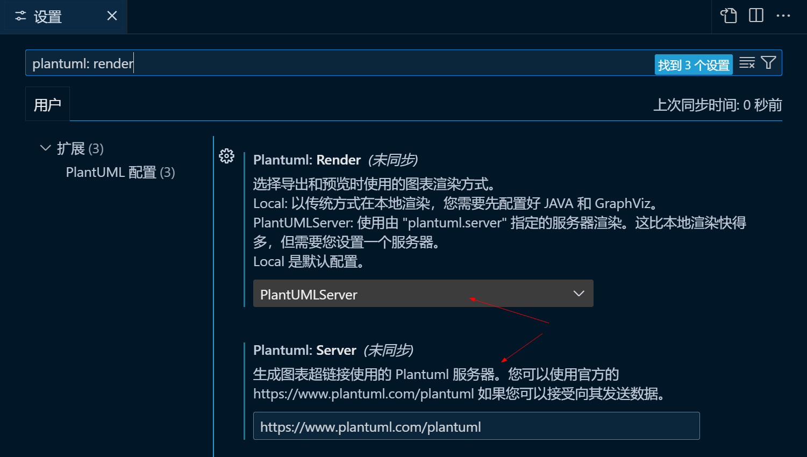
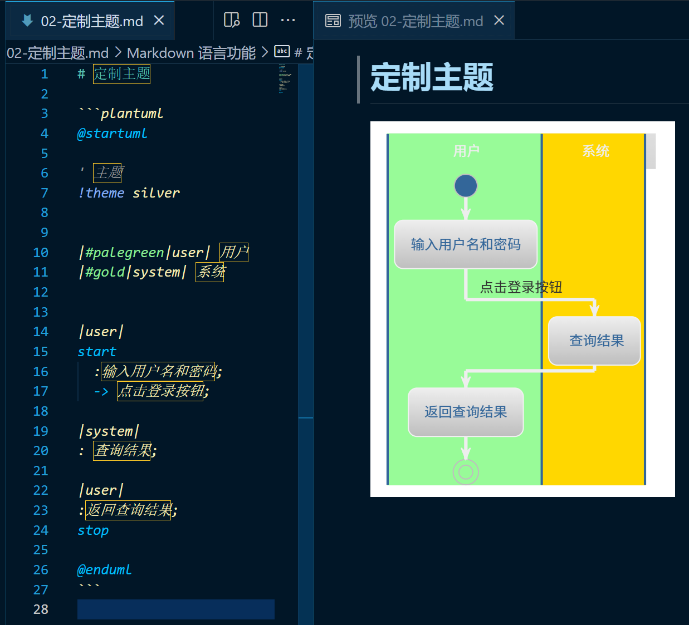

# VSCode + Markdown + PlantUml

下载插件：

1. Markdown Preview Enhanced
2. Markdown All in One
3. PlantUML

配置markdown中让uml正常展示

1. 下载`plantuml.jar`: https://plantuml.com/zh/download   
   eg: https://github.com/plantuml/plantuml/releases/download/v1.2024.8/plantuml-mit-1.2024.8.jar
   
2. `vscode` -> `setting` -> `markdown-preview-enhanced.plantumlJarPath` 中配置
   

最终效果：

---

### 其它

如果提示：`⚠️没有指定 PlantUML 服务器，请使用 "plantuml.server" 指定。`

vscode配置PlantUML服务器路径

最终效果：

