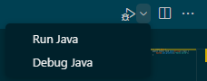
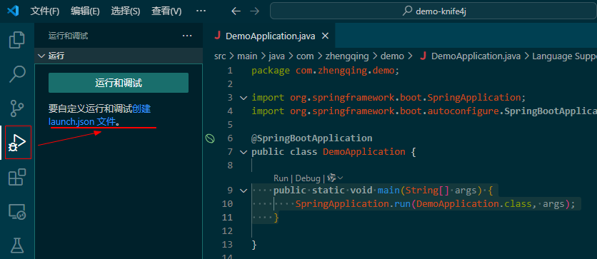
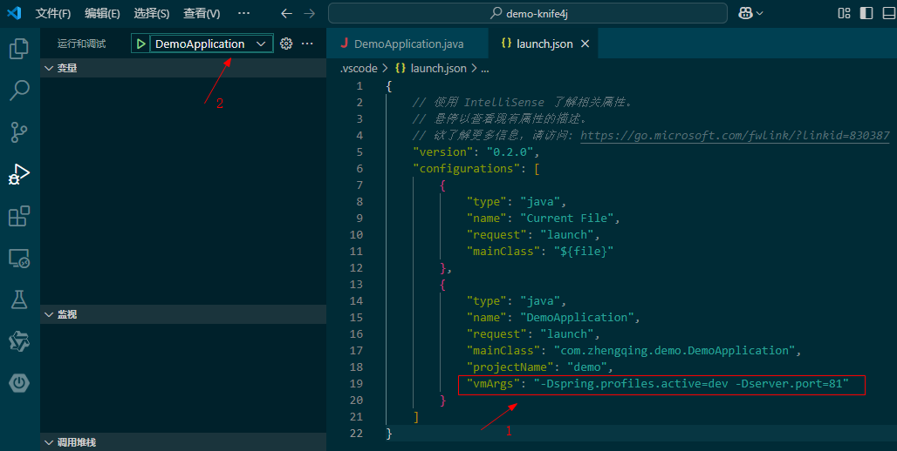
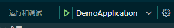
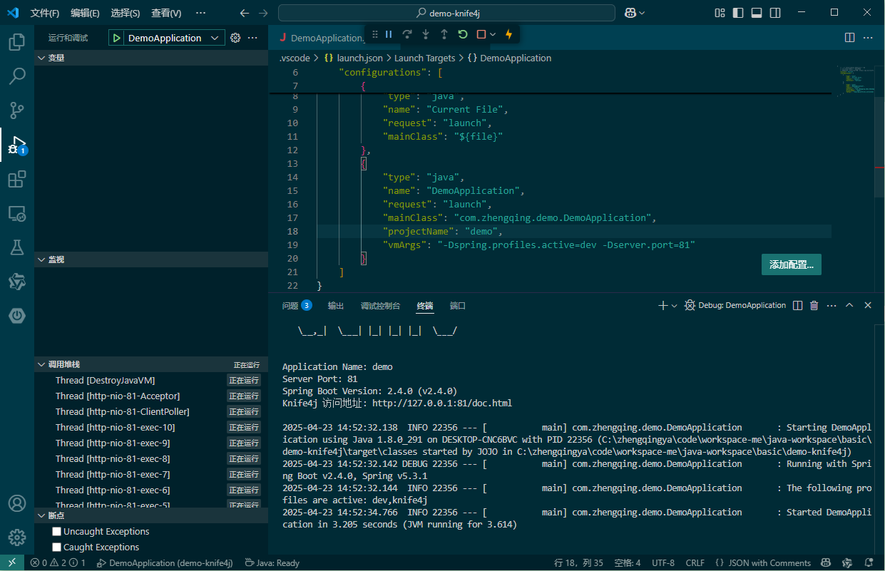
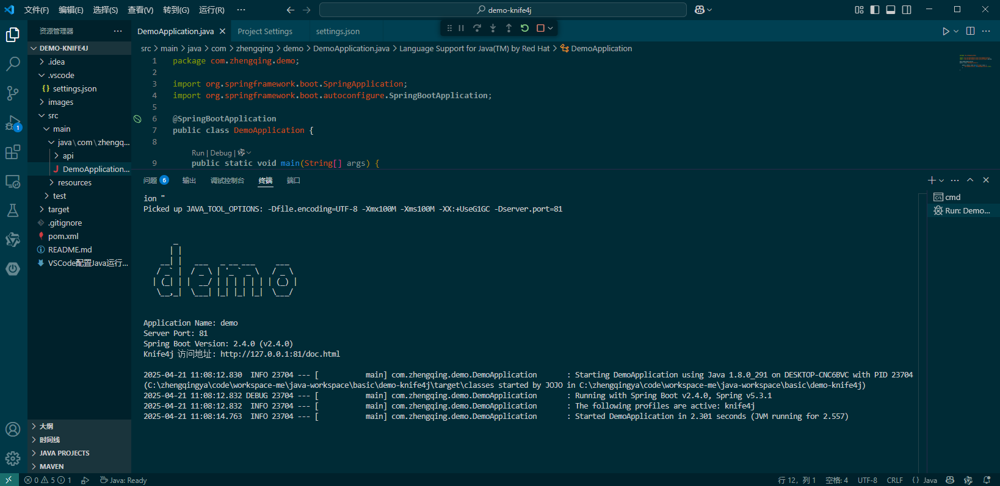

# VSCode配置Java运行环境

> 基于jdk8。

### 一、插件安装

1. Extension Pack for Java
2. Spring Boot Extension Pack

#### 测试

创建一个App.java文件，在文件右上角点击运行


```java
public class App {
    public static void main(String[] args) {
        System.out.println("hello world");
    }
}
```

### 二、运行SpringBoot项目 -- jvm启动参数配置

1、创建 [`.vscode/launch.json`](.vscode/launch.json) 文件


2、添加`vmArgs`参数配置


3、运行项目




### 三、settings.json配置文件 运行SpringBoot项目

> 简单点，用上面的方式即可。这里的不用看。

1. 快捷键`ctrl+shift+p` -> 输入 "Preferences: Open Workspace Settings (JSON)"
2. VSCode 会自动创建 `.vscode/settings.json` 文件

配置参考： [settings.json](.vscode/settings.json)

运行成功


