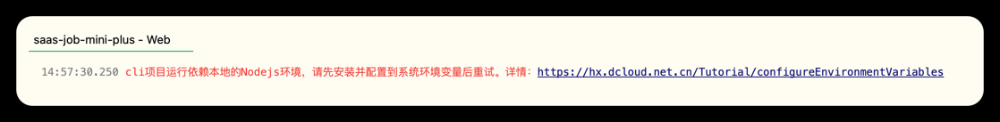
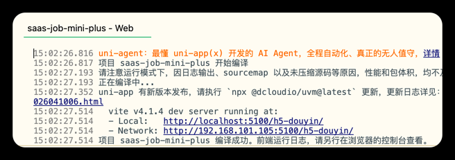

# 解决mac本地运行node环境问题

### 问题



```shell
14:57:30.250 cli项目运行依赖本地的Nodejs环境，请先安装并配置到系统环境变量后重试。详情：https://hx.dcloud.net.cn/Tutorial/configureEnvironmentVariables
```

### 解决

open ~/.bash_profile

新增如下配置

```shell
############################## ↓↓↓↓↓↓ set nvm environment ↓↓↓↓↓↓ #############################

export NVM_DIR="$HOME/.nvm"
[ -s "$NVM_DIR/nvm.sh" ] && \. "$NVM_DIR/nvm.sh"  # This loads nvm
[ -s "$NVM_DIR/bash_completion" ] && \. "$NVM_DIR/bash_completion"  # This loads nvm bash_completion

################################################################################################
```

```shell
# 让配置生效
source ~/.bash_profile
```

再次运行成功


