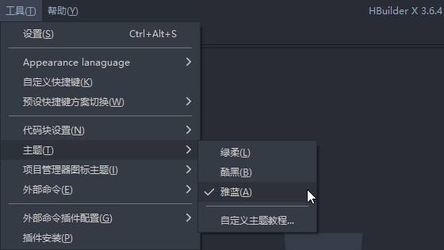
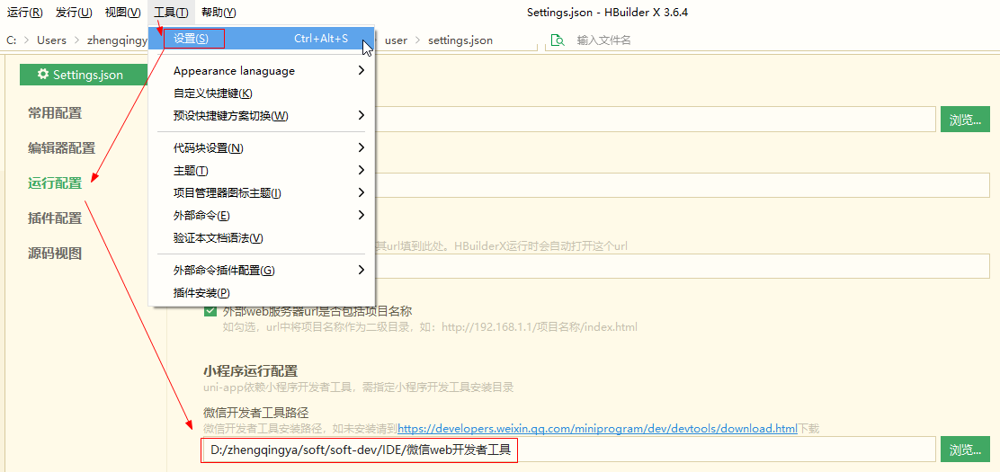

# HBuilderX

[点击下载](https://www.dcloud.io/)

### 安装 scss/sass 编译

> 为了方便编写样式 ex：``
> tips: 目前工具好像自带了，可不用管

插件地址：https://ext.dcloud.net.cn/plugin?name=compile-node-sass

### 快捷键

> VS Code

### 主题

### 配置微信开发者工具路径

到`微信开发者工具`中，通过`设置` -> `安全设置` 面板，开启“微信开发者工具”的服务端口

### 保存时自动格式化

