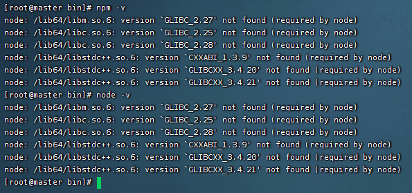
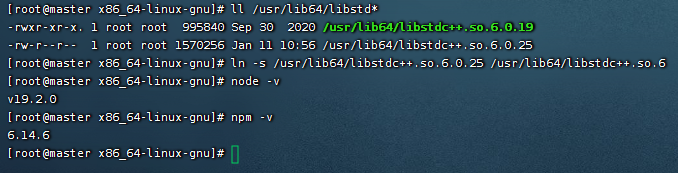
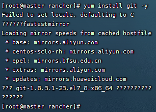
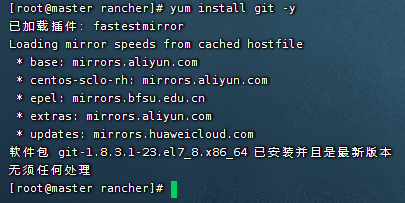

# 前端环境

### Node.js

> https://nodejs.org/zh-cn/download/

```shell
cd /home/soft

# 下载`node-v12.18.3-linux-x64.tar.xz` : https://nodejs.org/en/download/
wget https://nodejs.org/dist/v12.18.3/node-v12.18.3-linux-x64.tar.xz
# 解压
tar -xvf node-v12.18.3-linux-x64.tar.xz

# 配置环境变量
vi /etc/profile


############################## ↓↓↓↓↓↓ set nodejs environment ↓↓↓↓↓↓ #############################
NODEJS_HOME=/home/soft/node-v12.18.3-linux-x64
PATH=$PATH:$NODEJS_HOME/bin
export NODEJS_HOME PATH
#################################################################################################


# 使配置生效
source /etc/profile
# 查看版本
node -v
npm -v

# npm 升级
npm install -g npm

# 设置淘宝`NPM`镜像
npm install -g cnpm --registry=https://registry.npm.taobao.org
# 测试
cnpm -v

# 安装yarn
cnpm install -g yarn --registry=https://registry.npm.taobao.org
# 配置源
yarn config set registry https://registry.npm.taobao.org -g
yarn config set sass_binary_site http://cdn.npm.taobao.org/dist/node-sass -g
```

#### 其它

```shell
# 查看软链接
ls -il

# 建立软链接
# 将npm软连接到`/usr/bin`目录下 => 解决`sudo: npm：找不到命令`问题
sudo ln -s /home/soft/node-v12.18.3-linux-x64/bin/node /usr/bin/node
sudo ln -s /home/soft/node-v12.18.3-linux-x64/bin/npm /usr/bin/npm
sudo ln -s /home/soft/node-v12.18.3-linux-x64/bin/cnpm /usr/bin/cnpm
sudo ln -s /home/soft/node-v12.18.3-linux-x64/bin/npx /usr/lib/npx


# Linux删除软链接示例
rm -rf /usr/bin/node
rm -rf /usr/bin/npm
rm -rf /usr/bin/cnpm
rm -rf /usr/lib/npx


# nodejs 清空 npm 缓存
npm cache clean -f
```

#### 问题

> tips: 建议不要轻易改这个，感觉有坑... 一般正常服务器也不会出现这个问题，我这里是由于局域网的虚拟机出现此问题；
> 建议操作前存个快照。



```shell
node: /lib64/libm.so.6: version `GLIBC_2.27' not found (required by node)
node: /lib64/libc.so.6: version `GLIBC_2.25' not found (required by node)
node: /lib64/libc.so.6: version `GLIBC_2.28' not found (required by node)
node: /lib64/libstdc++.so.6: version `CXXABI_1.3.9' not found (required by node)
node: /lib64/libstdc++.so.6: version `GLIBCXX_3.4.20' not found (required by node)
node: /lib64/libstdc++.so.6: version `GLIBCXX_3.4.21' not found (required by node)
```

```shell
# 查看系统内安装的glibc版本
strings /lib64/libc.so.6 |grep GLIBC_
```

解决

> tips：可能需要半个小时时间吧...

```shell
cd /root
# 编译安装
wget http://ftp.gnu.org/gnu/glibc/glibc-2.28.tar.gz
tar xf glibc-2.28.tar.gz 
cd glibc-2.28/ && mkdir build  && cd build
../configure --prefix=/usr --disable-profile --enable-add-ons --with-headers=/usr/include --with-binutils=/usr/bin


# tips: 如果没报错可不用处理这里的步骤...
# ***********************************************************************
# 这一步提示如下错误
# configure: error: 
# *** These critical programs are missing or too old: compiler
# *** Check the INSTALL file for required versions.

# 解决：  升级gcc与make
# 1. 安装GCC-8
yum install -y devtoolset-8-gcc devtoolset-8-gcc-c++ devtoolset-8-binutils
# 设置环境变量
echo "source /opt/rh/devtoolset-8/enable" >> /etc/profile
source /etc/profile

# 2. 升级 make
wget https://ftp.gnu.org/gnu/make/make-4.3.tar.gz
tar -xzvf make-4.3.tar.gz && cd make-4.3/
# 安装到指定目录
./configure  --prefix=/usr/local/make
make && make install
# 创建软链接
cd /usr/bin/ && mv make make.bak
ln -sv /usr/local/make/bin/make /usr/bin/make

# 继续编译 glibc   -- 进入刚才安装`glibc-2.28/build`的目录
cd /root/glibc-2.28/build
../configure --prefix=/usr --disable-profile --enable-add-ons --with-headers=/usr/include --with-binutils=/usr/bin
# ***********************************************************************


make && make install
# 日志最后会出现如下问题
# primary library!
# make[1]: *** [Makefile:111: install] Error 1
# make[1]: Leaving directory '/root/glibc-2.28'
# make: *** [Makefile:12: install] Error 2

# 再次查看系统内安装的glibc版本
strings /lib64/libc.so.6 |grep GLIBC_

# 测试
node -v
npm -v

# 然后会报错如下：
# [root@master build]# node -v
# node: /lib64/libstdc++.so.6: version `CXXABI_1.3.9' not found (required by node)
# node: /lib64/libstdc++.so.6: version `GLIBCXX_3.4.20' not found (required by node)
# node: /lib64/libstdc++.so.6: version `GLIBCXX_3.4.21' not found (required by node)

# 解决
yum install libstdc++.so.6 -y
# 查看动态链接库 -- 发现并没有需要的1.3.9
strings /usr/lib/libstdc++.so.6 | grep 'CXXABI'
# 下载需要的版本库，之后软连接到运行系统上
wget http://ftp.de.debian.org/debian/pool/main/g/gcc-8/libstdc++6_8.3.0-6_amd64.deb
ar -x libstdc++6_8.3.0-6_amd64.deb
tar -xvf data.tar.xz
cp usr/lib/x86_64-linux-gnu/libstdc++.so.6.0.25 /usr/lib64/
find / -name "libstdc++*"
# 删除低版本库的软连接
rm -rf /usr/lib64/libstdc++.so.6
ll /usr/lib64/libstd*
ln -s /usr/lib64/libstdc++.so.6.0.25 /usr/lib64/libstdc++.so.6


# 检验
node -v
npm -v
```



##### 解决中文乱码问题



```shell
# 解决中文乱码问题
cd /root/glibc-2.28/build && make localedata/install-locales
```


