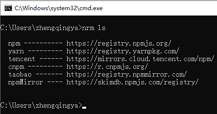

# nrm

https://github.com/Pana/nrm

nrm 是 Node.js 的 npm 源管理工具，允许您在使用 npm 安装或发布包时轻松切换不同的 npm 源。

### 一、安裝

```shell
npm install -g nrm
```

#### 问题

如果后面使用报错如下：

```shell
C:\Users\zhengqingya>nrm ls
D:\zhengqingya\soft\soft-dev\nvm\v16.18.0\node_modules\nrm\cli.js:9
const open = require('open');
             ^

Error [ERR_REQUIRE_ESM]: require() of ES Module D:\zhengqingya\soft\soft-dev\nvm\v16.18.0\node_modules\nrm\node_modules\open\index.js from D:\zhengqingya\soft\soft-dev\nvm\v16.18.0\node_modules\nrm\cli.js not supported.
Instead change the require of index.js in D:\zhengqingya\soft\soft-dev\nvm\v16.18.0\node_modules\nrm\cli.js to a dynamic import() which is available in all CommonJS modules.
    at Object.<anonymous> (D:\zhengqingya\soft\soft-dev\nvm\v16.18.0\node_modules\nrm\cli.js:9:14) {
  code: 'ERR_REQUIRE_ESM'
}
```

原因：应该使用 open 的 CommonJs规范的包 ，现在 open v9.0.0 是 ES Module 版本的包

解决

```shell
npm install -g nrm open@8.4.2 -save
```

### 二、使用



```shell
# 查看可选源，其中带有 * 号的表示当前正在使用的版本
nrm ls

# 查看当前源
nrm current

# 切换源 eg: 使用 taobao 源
nrm use taobao

# 添加源
nrm add <registry> <url>
# eg: 
nrm add cnpm https://registry.npm.taobao.org

# 删除源
nrm del <registry>

# 测试源速度
nrm test taobao
```
