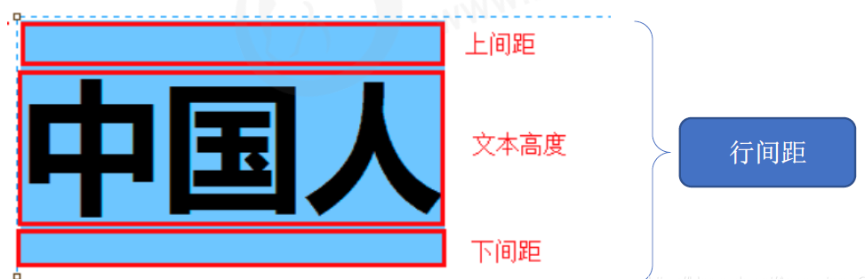

# CSS文本属性

CSS 文本属性可以设置文本的 外观，比如文本颜色、对齐文本、装饰文本、文本缩进、行间距的等

### 1、color

* color 属性用于定义文本的颜色

```
div {
    color: red;
}
```

| 表示 | 属性值 |
| --- | --- |
| 预定义的颜色值 | red，green，blue，pink等 |
| 十六进制 | #FF0000, #FF6600，#29D794 |
| RGB代码 | rgb（255，0，0） 或rgb(100%，0%，0%) |

实际开发中最常用的是十六进制。

### 2、text-align

* text-align 属性用于设置文本内容的水平对齐方式

```
div {
    text-align:center;
}
```

| 属性值 | 解释 |
| --- | --- |
| left | 左对齐（默认） |
| right | 右对齐 |
| center | 居中对齐 |

### 3、text-decoration

* text-decoration 属性用于装饰文本，可以给文本添加下划线，删除线，上划线等

```
div {
    text-decoration: underline;
}
```

| 属性值 | 描述 |
| --- | --- |
| none | 默认。没有装饰线(最常用) |
| underline | 下划线，链接自带下划线（常用） |
| overline | 上划线(几乎不用) |
| line-through | 删除线 (不常用) |

重点记住如何添加下划线，如何删除下划线，其余了解即可。

### 4、text-indent

* text-indent 属性用于指定文本的第一行缩进，通常是将段落的首行缩进

```
div {
    text-indent: 10px;
}

p {
   text-indent: 2em;
}
```

* 通过设置该水属性，所有元素的第一行都可以缩进一个给定的长度，甚至该长度可以是负值

* em是一个相对单位，就是当前元素(font-size)**1个文字的大小**

* 如果当前元素没有设置大小，则会按照父元素的一个文字大小

### 5、line-height

* line-height 属性用于设置行间的距离(行高)，可以控制文字行与行之间的距离

```
p {
   line-height: 26px;
}
```



行间距包括**上间距、文本高度、下间距**

### 6、文本属性总结

| 属性 | 表示 | 注意点 |
| --- | --- | --- |
| color | 文本颜色 | 通常用十六进制，而且是简写形式 #fff |
| text-align | 文本对齐 | 可以设定文字水平的对齐方式 |
| text-indent | 文本缩进 | 段落首行缩进 |
| text-decoration | 文本修饰 | 记住添加下划线 underline 取消下划线 none |
| line-height | 行高 | 控制行与行之间的距离 |
