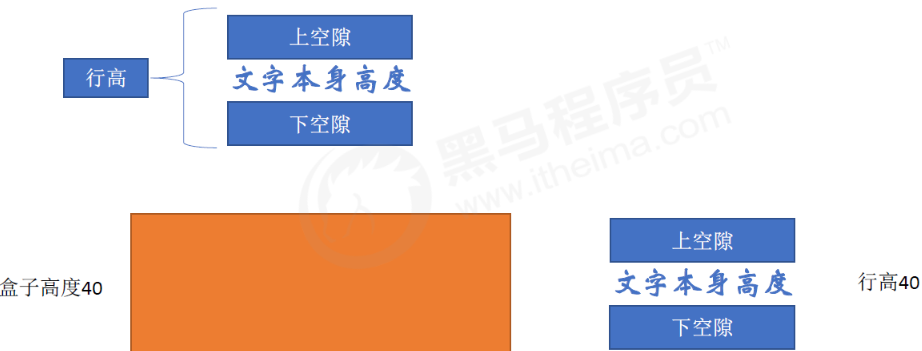

# CSS元素显示模式

### 1、块元素

1. 常见的块元素有`<h1>~<h6>、<p>、< div>、<ul>、<ol>、<li>`等，其中`<div>` 标签是最典型的块元素。
2. 块级元素的特点：
    - ①：比较霸道，自己独占一行
    - ②：高度，宽度，外边距以及内边距都可以控制
    - ③：宽度默认是容器（父级宽度）的100%
    - ④：是一个容器及盒子，里面可以放行内或块级元素
3. **注意：**
    - ①：文字类的元素内不能使用块级元素
    - ②：`<p>` 标签主要用于存放文字，因此`<p>`里面不能放块级元素，特别是不能放`<div>`
    - ③：同理，`<h1>~<h6>`等都是文字类块级标签，里面也不能存放其他块级元素。

### 2、行内元素

1. 常见的行内元素有`<a>、<strong>、<b>、<em>、<i>、<del>、<s>、<ins>、<u>、<span>`等
2. 其中`<span>`标签是**最典型的行内元素**。有的地方也将行内元素称为**内联元素**。
3. **行内元素的特点：**
    - ①：相邻行内元素在一行上，一行可以显示多个
    - ②：高，宽直接设置是无效的
    - ③：默认宽度就是它本身内容的宽度
    - ④：行内元素只能容纳文本或其他行内元素

**注意**：

* 链接里面不能再放链接
* 特殊情况链接`<a>`里面可以放块级元素，但是给`<a>`转换一下块级模式最安全

### 3、行内块元素

1. 在行内元素中有几个特殊的标签 —— `、<input />、<td>`，它们同时具有块元素和行内元素的特点
2. 有些资料称它们为**行内块**元素
3. 特点：
    - ①：和相邻行内元素在一行上，但是他们之间会有空白缝隙。一行可以显示多个(行内元素特点)
    - ②：默认宽度就是它本身内容的宽度(行内元素特点)
    - ③：高度，行高，外边距以及内边距都可以控制(块级元素特点)

### 4、元素显示模式总结

| 元素模式 | 元素排列 | 设置样式 | 默认宽度 | 包含 |
| --- | --- | --- | --- | --- |
| 块级元素 | 一行只能放一个块级元素 | 可以设置宽度高度 | 容器的100% | 容器级可以包含任何标签 |
| 行内元素 | 一行可以放多个行内元素 | 不可以直接设置宽度高度 | 它本身内容的宽度 | 容纳文本或其他行内元素 |
| 行内块元素 | 一行放多个行内块元素 | 可以设置宽度高度 | 它本身内容的宽度 |  |

### 5、元素显示模式转换

* 转换为块元素： `display:block`
* 转换为行内元素： `display:inline`
* 转换为行内块元素: `display:inline-block`

```
a {
   width: 150px;
   height: 50px;
   background-color: pink;
   /* 把行内元素 a 转换为 块级元素 */
   display: block;
}

div {
   width: 300px;
   height: 100px;
   background-color: purple;
   /* 把 div 块级元素转换为行内元素 */
   display: inline;
}

span {
   width: 300px;
   height: 30px;
   background-color: skyblue;
   display: inline-block;
}
```

```
<a href="#">hello</a>
<a href="#">hello</a>
<div>我是块级元素</div>
<div>我是块级元素</div>
<span>行内元素转换为行内块元素</span>
<span>行内元素转换为行内块元素</span>
```

### 6、小技巧

CSS没有给我们提供文字垂直居中的代码，这里我们可以用一个小技巧来实现单行文字垂直居中

解决方案：

* **让文字的行高等于盒子的高度，就可以让文字在当前盒子内垂直居中。**



简单理解：

* 行高的上空隙和下空隙把文字挤到中间了
* 如果是行高小于盒子高度，文字会偏上，如果行高大于盒子高度，则文字偏下
