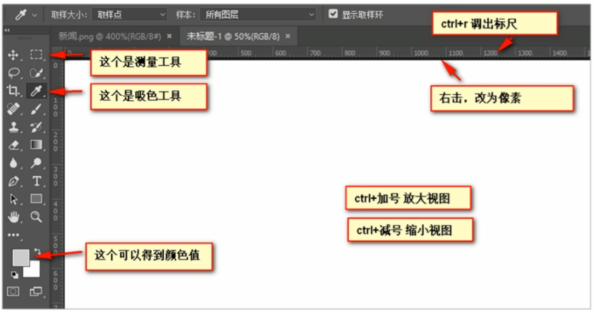

# PS基本操作

因为网页美工大部分效果图都是利用 PS（Photoshop）来做的，所以以后我们大部分切图工作都是在 PS 里面完成。

* 文件➡打开 ：可以打开我们要测量的图片
* Ctrl+R：可以打开标尺，或者 视图➡标尺
* 右击标尺，把里面的单位改为像素
* \==Ctrl+ 加号(+)==可以放大视图， ==Ctrl+ 减号(-)==可以缩小视图
* 按住空格键，鼠标可以变成小手，拖动 PS 视图
* 用选区拖动 可以测量大小
* Ctrl+ D 可以取消选区，或者在旁边空白处点击一下也可以取消选区

### PS切图

#### 1、图层切图

最简单的切图方式：右击图层 ➡导出 PNG 切片。

#### 2、切片切图

1. 利用切片选中图片: 利用切片工具手动划出
2. 导出选中的图片: 文件菜单➡存储为 web 设备所用的格式➡选择我们要的图片格式➡存储

#### 3、PS插件切图

Cutterman 是一款运行在 Photoshop 中的插件，能够自动将你需要的图层进行输出，以替代传统的手工 “导出 web 所用格式” 以及使用切片工具进行挨个切图的繁琐流程。

官网：[Cutterman官网](https://www.cutterman.cn)

注意：Cutterman 插件要求你的 PS 必须是完整版，不能是绿色版，所以大家需要安装完整版本
