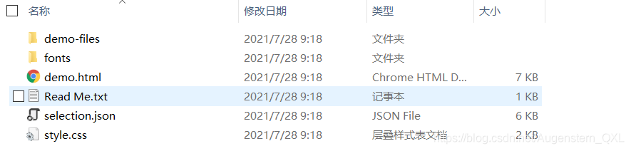
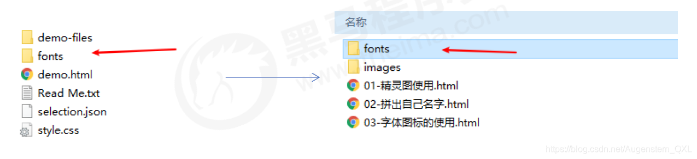
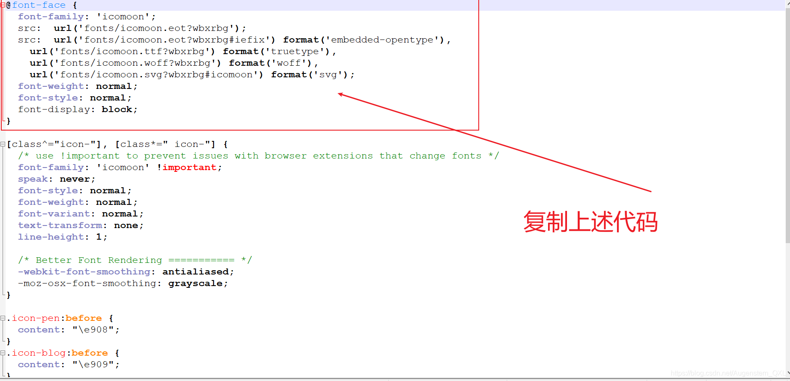
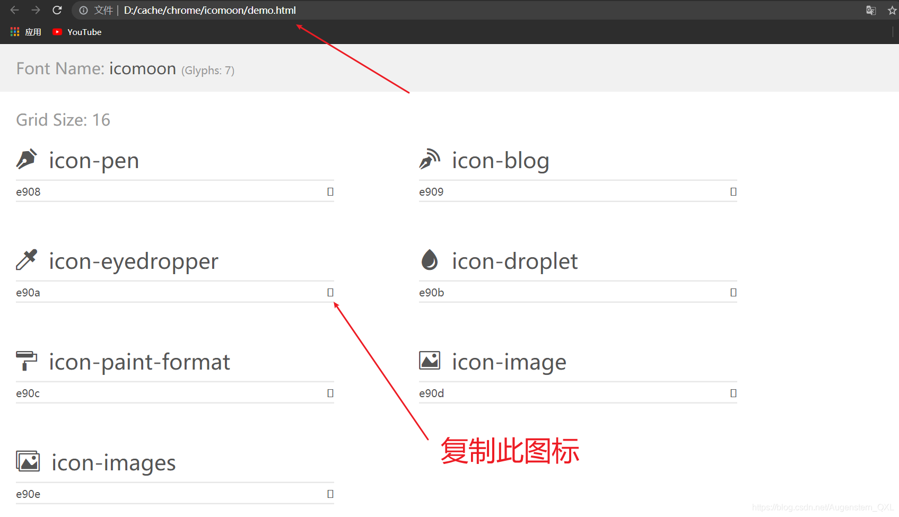
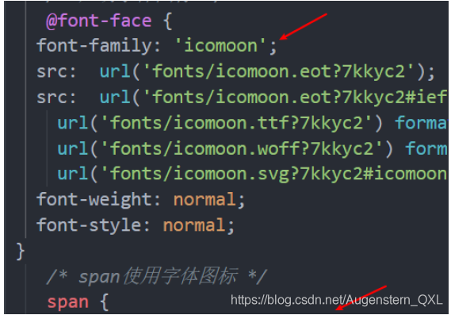
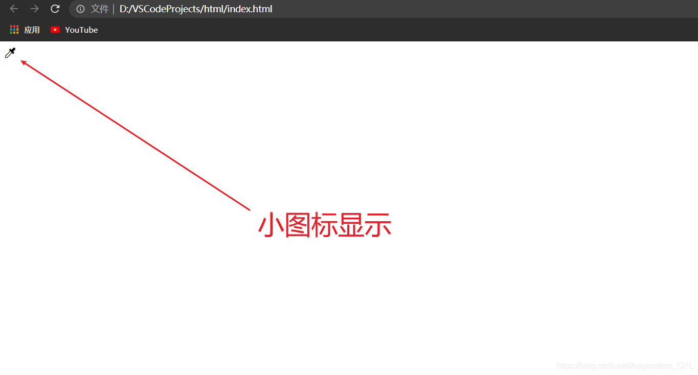
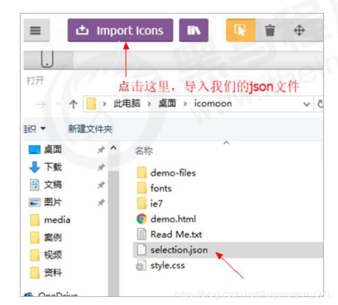
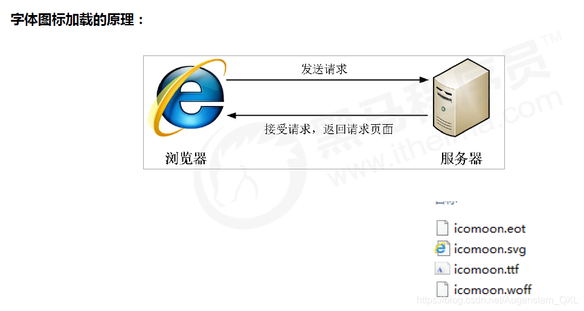

# 字体图标iconfont

字体图标使用场景： 主要用于显示网页中通用、常用的一些小图标。**展示的是图标，本质属于字体**

优点：

1. 轻量级：一个图标字体比一系列的图像要小，一旦字体加载了，图标就会马上渲染出来，减少了服务器的请求
2. 灵活性：本质其实是文字，可以很随意的改变颜色，产生阴影，透明效果，旋转等
3. 兼容性：几乎支持所有的浏览器

步骤：

1. 字体图标的下载
2. 字体图标的引入(引入到我们html页面中)
3. 字体图标的追加(以后添加新的小图标)

### 1、字体图标的下载

1. icomoon字库
   外网，不需要登录即可下载 [http://icomoon.io](http://icomoon.io/)
    * 点击 IcoMoon App
    * 选择需要的图标
    * 点击`Generate Font`
    * 点击 下载
2. 阿里iconfont字库
   免费，但是需要登录 [http://www.iconfont.cn/](http://www.iconfont.cn/)

### 2、字体图标的引入

我们以 icomoon 字库网为例，将下载包解压，解压之后的文件如图：



1. 把下载包里面的 fonts 文件夹放入页面根目录下
   
2. 在CSS样式中**全局声明**字体：简单理解把这些字体通过css引入到我们页面中
   右键打开 style.css，这里我演示用notepad++打开，复制如图代码引入我们自己的CSS文件中
   
   ```
   <style>
   @font-face {
        font-family: 'icomoon';
        src: url('fonts/icomoon.eot?7kkyc2');
        src: url('fonts/icomoon.eot?7kkyc2#iefix') format('embedded-opentype'),
        url('fonts/icomoon.ttf?7kkyc2') format('truetype'),
        url('fonts/icomoon.woff?7kkyc2') format('woff'),
        url('fonts/icomoon.svg?7kkyc2#icomoon') format('svg');
        font-weight: normal;
        font-style: normal;
   }
   </style>
   ```
3. html标签内添加小图标
   我们打开解压文件中的 demo.html ，复制想要的图标，粘贴进我们的 `<span></span>`标签中
   
4. 给标签定义字体
   ```
   /*span使用字体图标*/
   span {
    font-family: "icomoon";
   }
   ```
   
   注意：标签中的 `font-family` 的值和我们之前引入字体图标的`font-family` 必须一样，这里均为 icomoon
5. 完成，所以我们的整体代码为：
   ```
   <!DOCTYPE html>
   <html lang="en">
   <head>
       <meta charset="UTF-8">
       <meta http-equiv="X-UA-Compatible" content="IE=edge">
       <meta name="viewport" content="width=device-width, initial-scale=1.0">
       <title>Document</title>
       <style>
           @font-face {
               font-family: 'icomoon';
               src: url('fonts/icomoon.eot?7kkyc2');
               src: url('fonts/icomoon.eot?7kkyc2#iefix') format('embedded-opentype'), url('fonts/icomoon.ttf?7kkyc2') format('truetype'), url('fonts/icomoon.woff?7kkyc2') format('woff'), url('fonts/icomoon.svg?7kkyc2#icomoon') format('svg');
               font-weight: normal;
               font-style: normal;
           }
           
           span {
               font-family: "icomoon";
           }
       </style>
   </head>
   <body>
       <div>
           <span> </span>
       </div>
   </body>
   </html>
   ```
   测试效果为：
   

### 3、字体图标的追加

* 如果工作中，原来的字体图标不够用了，我们需要添加新的字体图标到原来的字体文件中。
* 以 icomoon字库 网为例，点击网站内`import icons`
* 把压缩包里面的 selection.json 重新上传，然后选中自己想要新的图标，重新下载压缩包，并替换原来的文件即可。



### 4、字体文件格式

不同浏览器所支持的字体格式是不一样的，字体图标之所以兼容，就是因为包含了主流浏览器支持的字体文件。

.ttf 格式、.woff 格式、.eot 格式、.svg 格式，不同浏览器支持不同的格式



### 5、字体图标总结

1. 如果遇到一些结构和样式比较简单的小图标，就用字体图标
2. 如果遇到一些结构和样式复杂一点的小图片，就用精灵图
