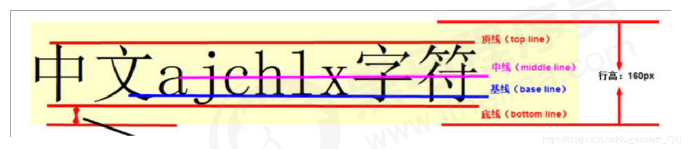
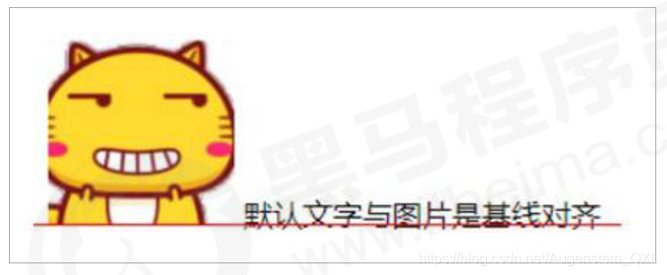

# vertical-align 实现行内块和文字垂直居中对齐

* 使用场景：经常用于设置**图片**或者**表单（行内块元素）**和**文字垂直对齐**。
* 官方解释：用于设置一个元素的垂直对齐方式，但是它只针对于**行内元素**或者**行内块元素**有效

```
vertical-align: baseline | top | middle | bottom
```

| 值        | 描述                        |
|----------|---------------------------|
| baseline | 默认，元素放置在父元素的基线上           |
| top      | 把元素的顶端与行中最高元素的顶端对齐（顶线对齐）  |
| middle   | 把此元素放置在父元素的中部（中线对齐）       |
| bottom   | 把元素的顶端与行中最低的元素的顶端对齐（底线对齐） |



### 1、图片、表单和文字对齐

图片、表单都属于行内块元素，默认的 vertical-align 是基线对齐。



此时可以给图片、表单这些行内块元素的 vertical-align 属性设置为 `middle` 就可以让文字和图片垂直居中对齐了。

### 2、图片底侧空白缝隙解决

* bug：图片底侧会有一个空白缝隙，原因是行内块元素会和文字的基线对齐（给图片加边框就可以看见）


主要解决办法有两种：

1. 给图片添加 `vertical-align : middle | top |bottom` 等
2. 把图片转换为块级元素 `display:block;`，因为块级元素不会有`vertical-align` 属性
