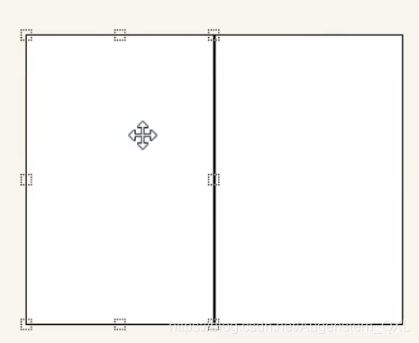
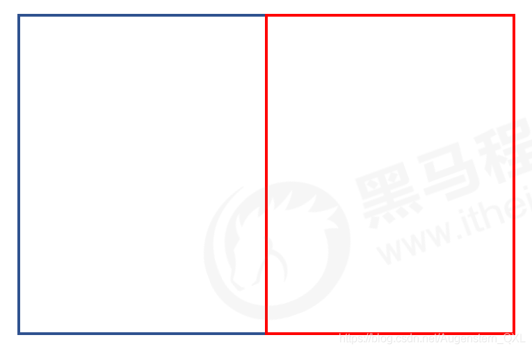
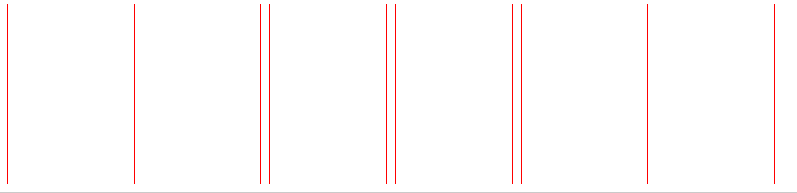
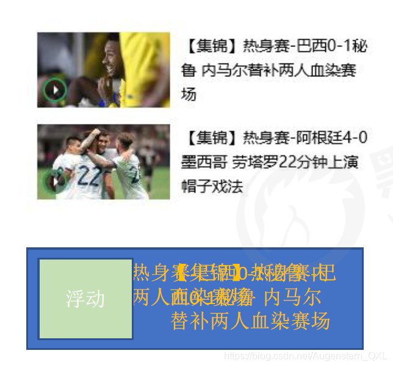
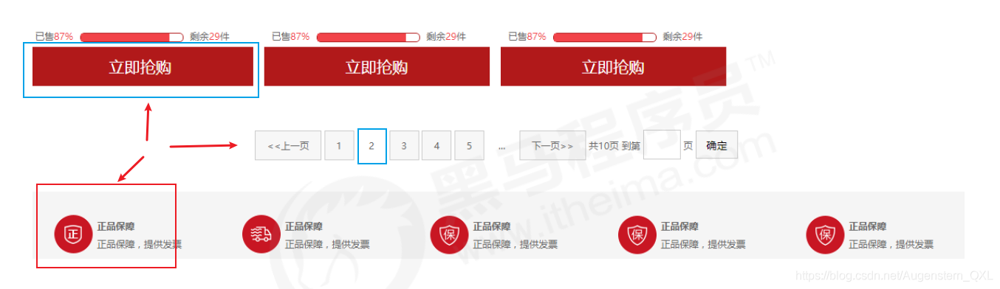
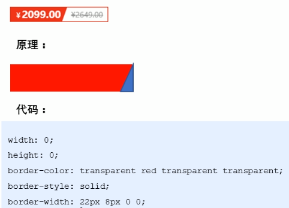
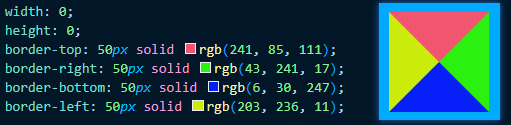
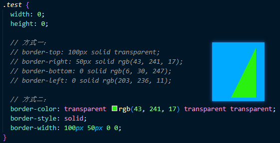

# 常见布局技巧

### 1、margin负值的运用

* 两个盒子加边框1px，浮动，贴紧会出现 1 + 1 = 2px
* 给右边盒子添加`margin-left: -1px`
* 正数向右边走，负数向左边走



当我们有多个盒子时的解决办法：



1. 让每个盒子 margin 往左侧移动 -1px 正好压住相邻盒子边框
2. 鼠标经过某个盒子的时候，提高当前盒子的层级即可
    * 如果没有定位，则加相对定位(保留位置)
    * 如果有定位，则加 z-index

```
<head>
<style>
    ul li {
        float: left;
        list-style: none;
        width: 150px;
        height: 200px;
        border: 1px solid red;
        margin-left: -11px
    }
    
    ul li:hover {
        position: relative;
        border: 1px solid blue;
    }
</style>
</head>
<body>
    <ul>
        <li></li>
        <li></li>
        <li></li>
        <li></li>
        <li></li>
        <li></li>
    </ul>
</body>
```



### 2、文字围绕浮动元素

巧妙运用浮动元素不会压住文字的特性



### 3、行内块巧妙运用



页码在页面中间显示：

1. 把这些链接盒子转换为行内块，之后给父级指定 `text-align: center`
2. 利用行内块元素中间有缝隙，并且给父级添加 `text-align: center` ，行内块元素会水平居中

### 4、三角



代码实现步骤：

给一个div设置样式




```
<div class="test"></div>

.test {
   width: 0;
   height: 0;
   
   // 方式一：
   // border-top: 100px solid transparent;
   // border-right: 50px solid rgb(43, 241, 17);
   // border-bottom: 0 solid rgb(6, 30, 247);
   // border-left: 0 solid rgb(203, 236, 11);
   
   // 方式二：
   border-color: transparent rgb(43, 241, 17) transparent transparent;
   border-style: solid;
   border-width: 100px 50px 0 0;
}
```