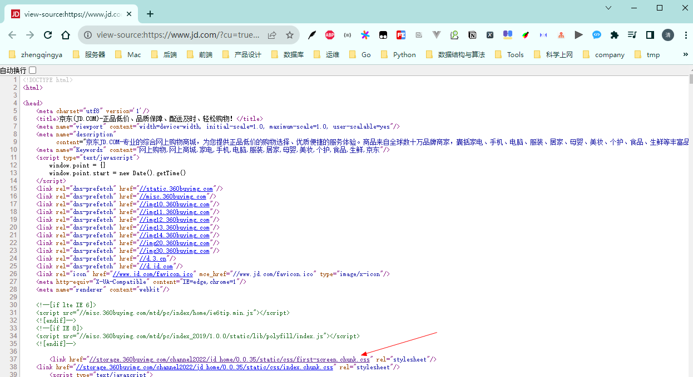

# CSS初始化

重设浏览器样式

eg： https://www.jd.com/

右击查看网页源代码


在 https://storage.360buyimg.com/channel2022/jd_home/0.0.35/static/css/first-screen.chunk.css
中搜索 body 拿到如下内容

```
* {
  margin: 0;
  padding: 0;
}
em,
i {
  font-style: normal;
}
li {
  list-style: none;
}
img {
  border: 0;
  vertical-align: middle;
}
button {
  cursor: pointer;
}
a {
  color: #666;
  text-decoration: none;
}
a:hover {
  color: #c81623;
}
button,
input {
  font-family:
    Microsoft YaHei,
    Heiti SC,
    tahoma,
    arial,
    Hiragino Sans GB,
    '\5B8B\4F53',
    sans-serif;
}
body {
  -webkit-font-smoothing: antialiased;
  background-color: #fff;
  font:
    12px/1.5 Microsoft YaHei,
    Heiti SC,
    tahoma,
    arial,
    Hiragino Sans GB,
    '\5B8B\4F53',
    sans-serif;
  color: #666;
}
.hide,
.none {
  display: none;
}
.clearfix:after {
  visibility: hidden;
  clear: both;
  display: block;
  content: '.';
  height: 0;
}
.clearfix {
  *zoom: 1;
}
```
