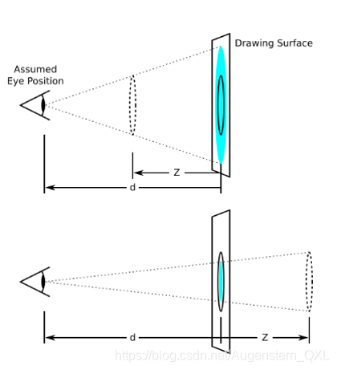
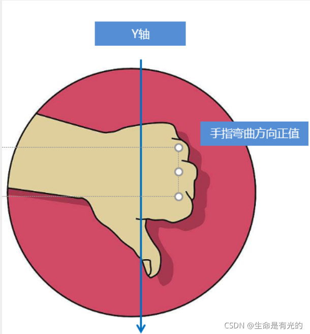
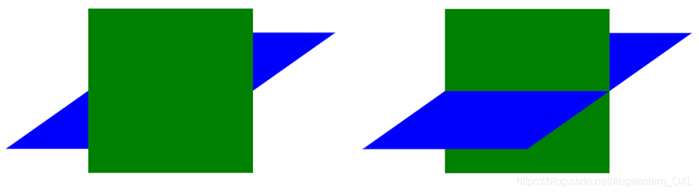

# CSS3 3D转换

我们生活的环境是3D的，照片就是3D物体在2D平面呈现的例子.

3D转换的特点：

* 近大远小。
* 物体后面遮挡不可见

当我们在网页上构建3D效果的时候参考这些特点就能产出3D效果。

### 1、三维坐标系

三维坐标系其实就是指立体空间，立体空间是由3个轴共同组成的。


* x轴：水平向右 **注意： x 右边是正值，左边是负值**
* y轴：垂直向下 **注意： y 下面是正值，上面是负值**
* z轴：垂直屏幕 **注意： 往外面是正值，往里面是负值**

3D 转换我们主要学习工作中最常用的 3D 位移 和 3D 旋转

### 2、3D位移translate3d

3D移动在2D移动的基础上多加了一个可以移动的方向，就是z轴方向

* `translform:translateX(100px)`：仅仅是在x轴上移动
* `translform:translateY(100px)`：仅仅是在Y轴上移动
* `translform:translateZ(100px)`：仅仅是在Z轴上移动（注意：translateZ一般用px单位）
* `transform:translate3d(x,y,z)`：其中 x、y、z 分别指要移动的轴的方向的距离

因为z轴是垂直屏幕，由里指向外面，所以默认是看不到元素在z轴的方向上移动

### 3、透视perspective

**透视**：在2D平面产生近大远小视觉立体，但是只是效果二维的

* 如果想要在网页产生3D效果需要透视（理解成3D物体投影在2D平面内）
* 模拟人类的视觉位置，可认为安排一只眼睛去看
* 透视我们也称为视距：视距就是人的眼睛到屏幕的距离
* 距离视觉点越近的在电脑平面成像越大，越远成像越小
* 透视的单位是像素

**透视写在被观察元素的父盒子上面的**



d：就是视距，视距就是一个距离人的眼睛到屏幕的距离。

z：就是 z轴，物体距离屏幕的距离，z轴越大（正值） 我们看到的物体就越大

### 4、translateZ

* translform:translateZ(100px)：仅仅是在Z轴上移动。
* 有了透视，就能看到translateZ 引起的变化了
    * translateZ：近大远小
    * translateZ：往外是正值
    * translateZ：往里是负值


### 5、3D旋转rotate3d

3D旋转：3D旋转指可以让元素在三维平面内沿着 x轴，y轴，z轴或者自定义轴进行旋转。

* transform: rotateX(45deg) ：沿着X轴正方向旋转45度
* transform: rotateY(45deg) ：沿着Y轴正方向旋转45度
* transform: rotateZ(45deg) ：沿着Z轴正方向旋转45度
* transform: rotate3d(x,y,z,deg) ：沿着自定义轴旋转 deg为角度(了解即可)

xyz是表示旋转轴的矢量，是标示你是否希望沿着该轴旋转，最后一个标示旋转的角度。

```
/*沿着X轴旋转45deg*/
transform: rotate3d(1,0,0,45deg) 
/*沿着对角线旋转45deg*/
transform: rotate3d(1,1,0,45deg) 
```

#### 👉左手准则①

* 左手的手拇指指向 x轴的正方向
* 其余手指的弯曲方向就是该元素沿着x轴旋转的方向


#### 👉左手准则②

* 左手的手拇指指向 y轴的正方向
* 其余手指的弯曲方向就是该元素沿着y轴旋转的方向（正值）  
  

### 6、3D呈现transform-style

3D呈现：transform-style

1. 控制子元素是否开启三维立体环境
2. `transform-style: flat` 子元素不开启3d立体空间 默认的
3. `transform-style: preserve-3d` 子元素开启立体空间
4. 代码写给父级，但是影响的是子盒子
5. 这个属性很重要


