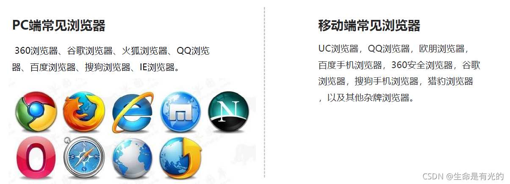
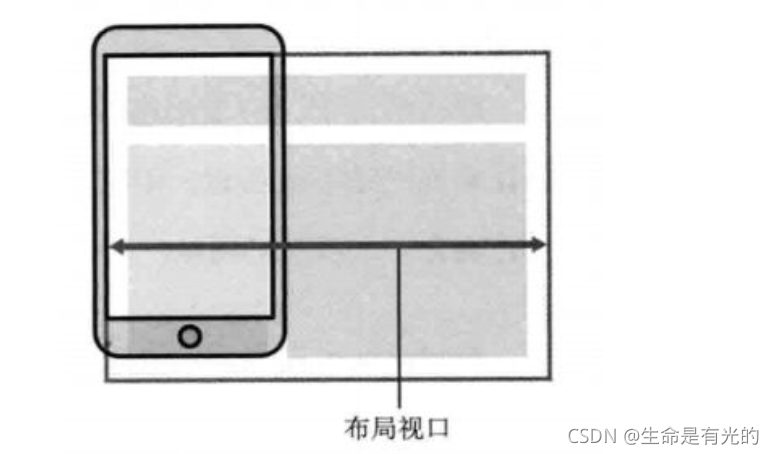
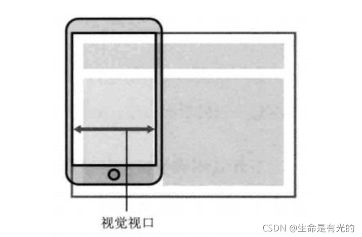
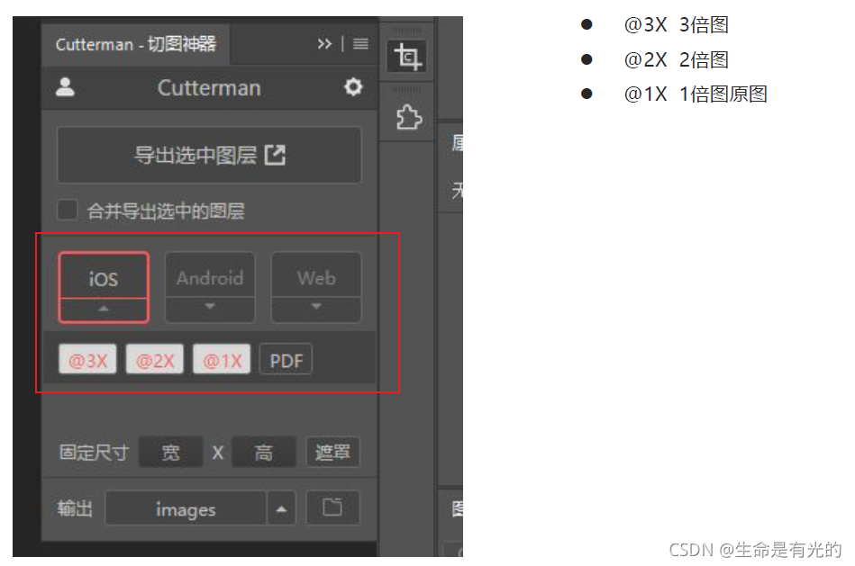
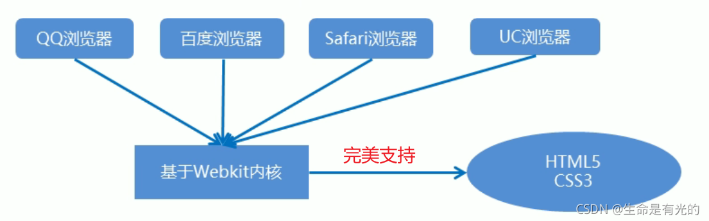

# 移动Web开发

### 1、浏览器现状



* 国内的 UC 和 QQ，百度等手机浏览器都是根据 Webkit 修改过来的内核，国内尚无自主研发的内核。

> 总结：兼容移动端主流浏览器，处理 Webkit 内核浏览器即可。

### 2、手机屏幕现状

* 移动端设备屏幕尺寸非常多，碎片化严重。
* Android设备有多种分辨率：480x800, 480x854, 540x960, 720x1280，1080x1920等，还有传说中的2K，4k屏。
* 近年来iPhone的碎片化也加剧了，其设备的主要分辨率有：640x960, 640x1136, 750x1334, 1242x2208等。
* `作为开发者无需关注这些分辨率，因为我们常用的尺寸单位是 px 。`

### 3、视口viewport

* 视口（viewport）就是浏览器显示页面内容的屏幕区域。 视口可以分为`布局视口、视觉视口和理想视口`
* 我们只需要关注理想视口

#### 3.1、布局视口layout viewport

* 一般移动设备的浏览器都默认设置了一个布局视口，用于解决早期的PC端页面在手机上显示的问题。
* iOS, Android基本都将这个视口分辨率设置为 980px，所以PC上的网页大多都能在手机上呈现，只不过元素看上去很小，一般默认可以通过手动缩放网页。



#### 3.2、视觉视口 visual viewport

* 字面意思，它是用户正在看到的网站的区域。`注意：是网站的区域。`
* 我们可以通过缩放去操作视觉视口，但不会影响布局视口，布局视口仍保持原来的宽度。



#### 3.3、理想视口 ideal viewport🔥

* 为了使网站在移动端有最理想的浏览和阅读宽度而设定
* 理想视口，对设备来讲，是最理想的视口尺寸
* 需要手动添写meta视口标签通知浏览器操作
* meta视口标签的主要目的：布局视口的宽度应该与理想视口的宽度一致，简单理解就是设备有多宽，我们布局的视口就多宽(
  乔布斯提出的哟)

#### 3.4、总结

* 视口就是浏览器显示页面内容的屏幕区域
* 视口分为布局视口、视觉视口和理想视口
* 我们移动端布局想要的是理想视口就是手机屏幕有多宽，我们的布局视口就有多宽
* 想要理想视口，我们需要给我们的移动端页面添加 meta视口标签

#### 3.5、meta视口标签

```
<meta name="viewport" content="width=device-width, user-scalable=no,initial-scale=1.0, maximum-scale=1.0, minimum-scale=1.0">
```

| 属性            | 解释说明                                          |
|---------------|-----------------------------------------------|
| width         | 宽度设置的是viewport宽度，可以设置device-width特殊值(宽度是设备宽度) |
| initial-scale | 初始缩放比，大于0的数字                                  |
| maximum-scale | 最大缩放比，大于0的数字                                  |
| minimum-scale | 最小缩放比，大于0的数字                                  |
| user-scalable | 用户是否可以缩放，yes或no（1或0）                          |

#### 3.6、标准的viewport设置

* 视口宽度和设备保持一致
* 视口的默认缩放比例1.0
* 不允许用户自行缩放
* 最大允许的缩放比例1.0
* 最小允许的缩放比例1.0

### 4、二倍图

#### 4.1、物理像素&物理像素比

* 物理像素点指的是屏幕显示的最小颗粒，是物理真实存在的。这是厂商在出厂时就设置好了,比如苹果 6/7/8 是 750*1334
* 我们开发时候的1px 不是一定等于1个物理像素的
* PC端页面，1个px 等于1个物理像素的，但是移动端就不尽相同
* 一个px的能显示的物理像素点的个数，称为物理像素比或屏幕像素比
* PC端 和 早前的手机屏幕 / 普通手机屏幕: 1CSS像素 = 1 物理像素的

Retina（视网膜屏幕）是一种显示技术，可以将把更多的物理像素点压缩至一块屏幕里，从而达到更高的分辨率，并提高屏幕显示的细腻程度。由于
Retina 的出现，对于一张 50px * 50px 的图片,在手机 Retina
屏中打开，按照刚才的物理像素比会放大倍数，这样会造成图片模糊。

`例如：我们需要一个 50*50 像素(css像素)的图片，直接放到我们的手机里面会放大2倍变成 100 * 100，这样就会模糊。`

`解决办法：我们直接放一个 100 * 100 图片，然后手动的把这个图片缩小为 50 * 50。这样将图放到手机里面，手机自动放大2倍变成 100 * 100，这样就不会造成图片模糊`

我们准备的图片，比我们实际需要的大小大2倍，这种方式就是二倍图

#### 4.2、背景缩放 background-size

我们的图片需要进行放大处理，那么我们的背景图片也是需要进行缩放处理。

```
background-size: 背景图片宽度 背景图片高度;
```

* 单位： 长度|百分比|cover|contain
* cover把背景图像扩展至足够大，以使背景图像完全覆盖背景区域。
* contain把图像图像扩展至最大尺寸，以使其宽度和高度完全适应内容区域

#### 4.3、多倍图切图 cutterman



### 5、移动端开发选择

1. 单独制作移动端页面(主流)，通常情况下，网址域名前面加 m(mobile) 可以打开移动端。
    * m.taobao.com
    * m.jd.com
    * m.suning.com
    * 通过判断设备，如果是移动设备打开，则跳到移动端页面。
2. 响应式页面兼容移动端(其次)

### 6、移动端浏览器

* 移动端浏览器基本以 webkit 内核为主，因此我们就考虑webkit兼容性问题。
* 我们可以放心使用 H5 标签和 CSS3 样式。
* 同时我们浏览器的私有前缀我们只需要考虑添加 webkit 即可



### 7、CSS初始化 normalize.css

移动端 CSS 初始化推荐使用 normalize.css

官网地址：[http://necolas.github.io/normalize.css/](http://necolas.github.io/normalize.css/)

### 8、CSS3盒子模型 box-sizing

* 传统模式宽度计算：盒子的宽度 = CSS中设置的width + border + padding
* CSS3盒子模型： 盒子的宽度 = CSS中设置的宽度width，里面包含了 border 和 padding

也就是说，我们的CSS3中的盒子模型， padding 和 border 不会撑大盒子了

```
/*CSS3盒子模型*/
box-sizing: border-box;
/*传统盒子模型*/
box-sizing: content-box;
```

* 移动端可以全部CSS3 盒子模型
* PC端如果完全需要兼容，我们就用传统模式，如果不考虑兼容性，我们就选择 CSS3 盒子模型

### 9、特殊样式

```
/*CSS3盒子模型*/
box-sizing: border-box;
-webkit-box-sizing: border-box;

/*点击高亮我们需要清除 设置为transparent 完成透明*/
-webkit-tap-highlight-color: transparent;

/*在移动端浏览器默认的外观在iOS上加上这个属性才能给按钮和输入框自定义样式*/
-webkit-appearance: none;

/*禁用长按页面时的弹出菜单*/
img,a { 
    -webkit-touch-callout: none;
}
```
