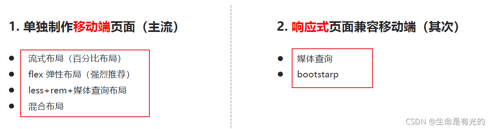
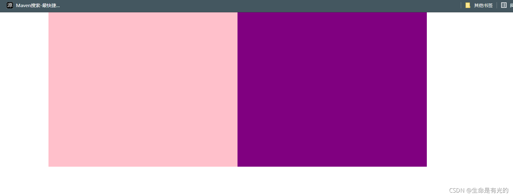
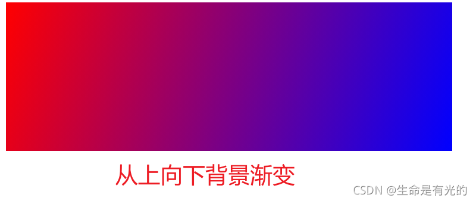
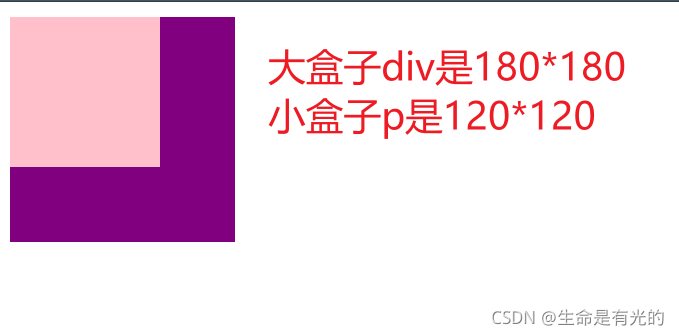
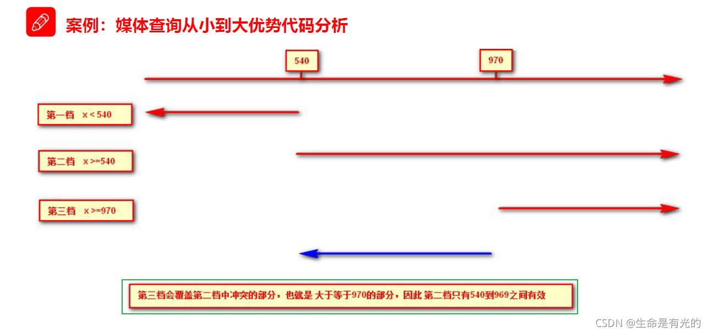
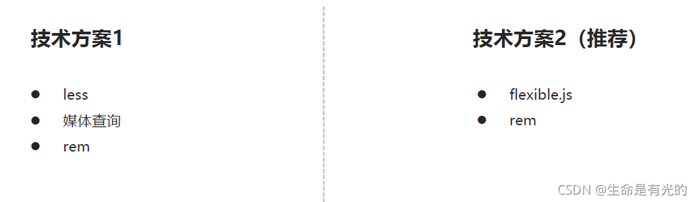
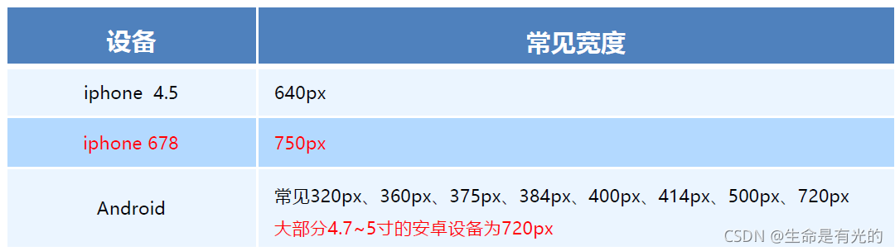

# 移动端常见布局



### 1、流式布局(百分比布局)

* 流式布局，就是百分比布局，也称非固定像素布局。
* 通过盒子的宽度设置成百分比来根据屏幕的宽度来进行伸缩，不受固定像素的限制，内容向两侧填充。

```
<head>
    <meta charset="UTF-8">
    <meta name="viewport" content="width=device-width, initial-scale=1.0">
    <meta http-equiv="X-UA-Compatible" content="ie=edge">
    <title>Document</title>
    <style>
        * {
            margin: 0;
            padding: 0;
        }
        
        section {
            width: 100%;
            max-width: 980px;
            min-width: 320px;
            margin: 0 auto;
        }
        
        section div {
            float: left;
            width: 50%;
            height: 400px;
        }
        
        section div:nth-child(1) {
            background-color: pink;
        }
        
        section div:nth-child(2) {
            background-color: purple;
        }
    </style>
</head>

<body>
    <section>
        <div></div>
        <div></div>
    </section>
</body>
```



#### 背景颜色渐变

```
<head>
    <meta charset="UTF-8">
    <meta name="viewport" content="width=device-width, initial-scale=1.0">
    <meta http-equiv="X-UA-Compatible" content="ie=edge">
    <title>Document</title>
    <style>
        div {
            width: 600px;
            height: 200px;
            /* 背景渐变必须添加浏览器私有前缀 */
            /* background: -webkit-linear-gradient(left, red, blue); */
            /* background: -webkit-linear-gradient(red, blue); */
            background: -webkit-linear-gradient(top left, red, blue);
        }
    </style>
</head>

<body>
    <div></div>
</body>
```



### 2、flex弹性布局

见[flex](./布局/flex/flex.md)

### 3、rem适配布局

我们来看几个问题：

1. 页面布局文字能否随着屏幕大小变化而变化？
2. 流式布局和flex布局主要针对于宽度布局，那高度如何设置？
3. 怎么样让屏幕发生变化的时候元素高度和宽度等比例缩放？

#### 1、rem基础

* rem (root em)是一个相对单位，类似于em，em是父元素字体大小。
* 不同的是rem的基准是相对于html元素的字体大小。
    * 比如，根元素（html）设置font-size=12px; 非根元素设置width:2rem; 则换成px表示就是24px
    * rem的优势：父元素文字大小可能不一致， 但是整个页面只有一个html，可以很好来控制整个页面的元素大小

```
<head>
    <meta charset="UTF-8">
    <meta name="viewport" content="width=device-width, initial-scale=1.0">
    <meta http-equiv="X-UA-Compatible" content="ie=edge">
    <title>Document</title>
    <style>
        html {
            font-size: 12px;
        }
        
        div {
            font-size: 12px;
            width: 15rem;
            height: 15rem;
            background-color: purple;
        }
        
        p {
            /* 1. em相对于父元素 的字体大小来说的 */
            /* width: 10em;
            height: 10em; */
            /* 2. rem 相对于 html元素 字体大小来说的 */
            width: 10rem;
            height: 10rem;
            background-color: pink;
            /* 3.rem的优点就是可以通过修改html里面的文字大小来改变页面中元素的大小可以整体控制 */
        }
    </style>
</head>

<body>
    <div>
        <p></p>
    </div>
</body>
```



#### 2、媒体查询

媒体查询（Media Query）是CSS3新语法。

* 使用 @media 查询，可以针对不同的媒体类型定义不同的样式
* `@media 可以针对不同的屏幕尺寸设置不同的样式`
* 当你重置浏览器大小的过程中，页面也会根据浏览器的宽度和高度重新渲染页面
* 目前针对很多苹果手机、Android手机，平板等设备都用得到多媒体查询

语法如下：

```
@media mediatype and|not|only(media feature){
    CSS-code
}
```

* 用 @media 开头 注意@符号
* mediatype 媒体类型
* 关键字 and not only
* media feature 媒体特性 必须有小括号包含

```
<head>
    <meta charset="UTF-8">
    <meta name="viewport" content="width=device-width, initial-scale=1.0">
    <meta http-equiv="X-UA-Compatible" content="ie=edge">
    <title>Document</title>
    <style>
        /* 这句话的意思就是： 在我们屏幕上 并且 最大的宽度是 800像素 设置我们想要的样式 */
        /* max-width 小于等于800 */
        /* 媒体查询可以根据不同的屏幕尺寸在改变不同的样式 */
        
        @media screen and (max-width: 800px) {
            body {
                background-color: pink;
            }
        }
        
        @media screen and (max-width: 500px) {
            body {
                background-color: purple;
            }
        }
    </style>
</head>
```

上面代码的意思是在我们屏幕上页面处于 500px-800px 之间，页面背景颜色显示为 pink 色。页面小于 500px，背景颜色显示为 purple 色

##### ① mediatype查询类型

将不同的终端设备划分成不同的类型，称为媒体类型

| 值       | 解释说明                |
|---------|---------------------|
| all     | 用于所有设备              |
| print   | 用于打印机和打印预览          |
| `scree` | `用于电脑屏幕、平板电脑、智能手机等` |

##### ② 关键字

关键字将媒体类型或多个媒体特性连接到一起做为媒体查询的条件。

* and：可以将多个媒体特性连接到一起，相当于“且”的意思。
* not：排除某个媒体类型，相当于“非”的意思，可以省略。
* only：指定某个特定的媒体类型，可以省略。

##### ③ 媒体特性

每种媒体类型都具体各自不同的特性，根据不同媒体类型的媒体特性设置不同的展示风格。我们暂且了解三个。`注意他们要加小括号包含`。

| 值         | 解释                |
|-----------|-------------------|
| width     | 定义输出设备中页面可见区域的宽度  |
| min-width | 定义输出设备中页面最小可见区域宽度 |
| max-width | 定义输出设备中页面最大可见区域宽度 |

注意： 为了防止混乱，媒体查询我们要按照从小到大或者从大到小的顺序来写,但是我们最喜欢的还是从小到大来写，这样代码更简洁

```
<head>
    <meta charset="UTF-8">
    <meta name="viewport" content="width=device-width, initial-scale=1.0">
    <meta http-equiv="X-UA-Compatible" content="ie=edge">
    <title>Document</title>
    <style>
        /* 1. 媒体查询一般按照从大到小或者 从小到大的顺序来 */
        /* 2. 小于540px 页面的背景颜色变为蓝色 */
        
        @media screen and (max-width: 539px) {
            body {
                background-color: blue;
            }
        }
        /* 3. 540 ~ 970 我们的页面颜色改为 绿色 */
        /* @media screen and (min-width: 540px) and (max-width: 969px) {
            body {
                background-color: green;
            }
        } */
        
        @media screen and (min-width: 540px) {
            body {
                background-color: green;
            }
        }
        /* 4. 大于等于970 我们页面的颜色改为 红色 */
        
        @media screen and (min-width: 970px) {
            body {
                background-color: red;
            }
        }
        /* 5. screen 还有 and 必须带上不能省略的 */
        /* 6. 我们的数字后面必须跟单位  970px   这个 px 不能省略的 */
    </style>
</head>
```



##### ④ 媒体查询+rem实现元素动态大小变化

* rem单位是跟着html来走的，有了rem页面元素可以设置不同大小尺寸
* 媒体查询可以根据不同设备宽度来修改样式
* 媒体查询+rem 就可以实现不同设备宽度，实现页面元素大小的动态变化

```
<head>
    <meta charset="UTF-8">
    <meta name="viewport" content="width=device-width, initial-scale=1.0">
    <meta http-equiv="X-UA-Compatible" content="ie=edge">
    <title>Document</title>
    <style>
        * {
            margin: 0;
            padding: 0;
        }
        /* html {
            font-size: 100px;
        } */
        /* 从小到大的顺序 */
        
        @media screen and (min-width: 320px) {
            html {
                font-size: 50px;
            }
        }
        
        @media screen and (min-width: 640px) {
            html {
                font-size: 100px;
            }
        }
        
        .top {
            height: 1rem;
            font-size: .5rem;
            background-color: green;
            color: #fff;
            text-align: center;
            line-height: 1rem;
        }
    </style>
</head>
<body>
    <div class="top">购物车</div>
</body>
```

上述代码的意思是：
屏幕尺寸小于320px，
div 大小为 0.5*50 = 25px，
屏幕尺寸大于 320px 小于 640px，
div 大小为 0.5 * 100 = 50px

##### ⑤ 引入资源

* 当样式比较繁多的时候，我们可以针对不同的媒体使用不同 stylesheets（样式表）。
* 原理，就是直接在link中判断设备的尺寸，然后引用不同的css文件。

语法：

```
<link rel="stylesheet" media="mediatype and|not|only (media feature)" href="mystylesheet.css">
```

示例：

```
<link rel="stylesheet" href="styleA.css" media="screen and (min-width: 400px)">
```

### 4、Less

CSS 是一门非程序式语言，没有变量、函数、SCOPE（作用域）等概念。

* CSS 需要书写大量看似没有逻辑的代码，CSS 冗余度是比较高的。
* 不方便维护及扩展，不利于复用。
* CSS 没有很好的计算能力
* 非前端开发工程师来讲，往往会因为缺少 CSS 编写经验而很难写出组织良好且易于维护的 CSS 代码项目。

Less （Leaner Style Sheets 的缩写） 是一门 CSS 扩展语言，也成为CSS预处理器。

* 做为 CSS 的一种形式的扩展，它并没有减少 CSS 的功能，而是在现有的 CSS 语法上，为CSS加入程序式语言的特性。
* 它在 CSS 的语法基础之上，引入了变量，Mixin（混入），运算以及函数等功能，大大简化了 CSS 的编写，并且降低了 CSS
  的维护成本，就像它的名称所说的那样，Less 可以让我们用更少的代码做更多的事情。
* Less中文网址： http://lesscss.cn/
* Less 是一门 CSS 预处理语言，它扩展了CSS的动态特性。

##### 1、Less安装

安装：(如果使用vscode无需安装less)

```
npm install -g less
```

查看版本：

```
lessc -v 
```

我们首先新建一个后缀名为less的文件， 在这个less文件里面书写less语句。

##### 2、Less变量

```
@变量名: 值;
```

变量命名规范

* 必须有@为前缀
* 不能包含特殊字符
* 不能以数字开头
* 大小写敏感

```
@color: pink;
```

变量是指没有固定的值，可以改变的。因为我们CSS中的一些颜色和数值等经常使用。

```
//直接使用
body{
	color: @color;
}
a:hover{
	color: @color;
}
```

##### 3、Less编译

我们需要把我们的 less文件，编译生成为css文件，这样我们的html页面才能使用。

我们可以在 vscode 安装 `Easy LESS` 插件来把 less 文件编译为 css。安装完毕插件，重新加载下 vscode。只要保存一下Less文件，会自动生成CSS文件。

##### 4、Less嵌套

我们经常用到选择器的嵌套

```
#header .logo {
	width: 300px;
}

#header {
    .logo{
        width: 300px;
    }
}
```

如果遇见 （交集|伪类|伪元素选择器）

* 内层选择器的前面没有 & 符号，则它被解析为父选择器的后代
* 如果有 & 符号，它就被解析为父元素自身或父元素的伪类

```
a:hover{
    color: red;
}
```

```
a{
    &:hover{
        color: red;
    }
}
```

##### 5、Less运算

任何数字、颜色或者变量都可以参与运算。就是Less提供了加（+）、减（-）、乘（*）、除（/）算术运算。

```
@width: 10px + 5;
div {
    border: @width solid red;
}

/* 生成的css */
div {
    border: 15px solid red;
}

/* Less甚至还可以这样 */
width: (@width + 5) * 2;
```

注意：

* 乘号（*）和除号（/）的写法
* 运算符中间左右有个空格隔开 1px + 5
* 对于两个不同的单位的值之间的运算，运算结果的值取第一个值的单位
* 如果两个值之间只有一个值有单位，则运算结果就取该单位

### 5、rem适配方案

1. 让一些不能等比自适应的元素，达到当设备尺寸发生改变的时候，等比例适配当前设备。
2. 使用媒体查询根据不同设备按比例设置html的字体大小，然后页面元素使用rem做尺寸单位，当html字体大小变化元素尺寸也会发生变化，从而达到等比缩放的适配。

实际开发中适配方案：

1. 按照设计稿与设备宽度的比例，动态计算并设置 html 根标签的 font-size 大小；（媒体查询）
2. CSS 中，设计稿元素的宽、高、相对位置等取值，按照同等比例换算为 rem 为单位的值；

rem 适配方案技术使用



##### rem实际开发适配方案1

rem + 媒体查询 + less 技术



一般情况下，我们以一套或两套效果图适应大部分的屏幕，放弃极端屏或对其优雅降级，牺牲一些效果。现在基本以750为准。

> 动态设置 html 标签 font-size 大小

1. 假设设计稿是750px
2. 假设我们把整个屏幕划分为15等份（划分标准不一可以是20份也可以是10等份）
3. 每一份作为html字体大小，这里就是50px
4. 那么在320px设备的时候，字体大小为320/15 就是 21.33px
5. 用我们页面元素的大小 除以不同的 html 字体大小会发现他们比例还是相同的
6. 比如我们以 750为标准设计稿
7. 一个100*100像素的页面元素 在 750屏幕下， 就是 100 / 50 转换为rem 是 2rem * 2 rem 比例是 1比1
8. 320屏幕下， html 字体大小为 21.33 则 2rem = 42.66px 此时宽和高都是 42.66 但是 宽和高的比例还是 1比1
9. 但是已经能实现不同屏幕下 页面元素盒子等比例缩放的效果

> 元素大小取值方法

1. 最后的公式： 页面元素的rem值 = 页面元素值（px） / （屏幕宽度 / 划分的份数）
2. 屏幕宽度/划分的份数 就是 html font-size 的大小
3. 或者： 页面元素的rem值 = 页面元素值（px） / html font-size 字体大小

##### rem实际开发适配方案2 flexible.js

- 手机淘宝团队出的简洁高效移动端适配库
- 我们再也不需要在写不同屏幕的媒体查询，因为里面js做了处理
- 它的原理是把当前设备划分为10等份，但是不同设备下，比例还是一致的。
- 我们要做的，就是确定好我们当前设备的html文字大小就可以了
- 比如当前设计稿是750px，那么我们只需要把html文字大小设置为75px（750px/10）就可以
- 里面页面元素rem值：页面元素的px值/75
- 剩余的，让flexible.js来去算

github地址：https://github.com/amfe/lib-flexible

### 6、vw/vh

目标：实现在不同宽度的设备中，网页元素尺寸等比缩放效果

视口被均分为100单位，能够实现大小跟随视口的大小而改变。

- 1vw：视口宽度的1%
- 100vw：视口宽度的100%
- 1vh：视口高度的1%
- 100vh：视口高度的100%

#### 1vw 和 1%

- width: 1vw;
- width: 1%;

vw和1%区别：

1. vw永远是以视口的宽度为准。在375设计稿下，1vw永远是3.75px
2. 百分比以父盒子为准。假如父盒子是200ps，则1%是2px
