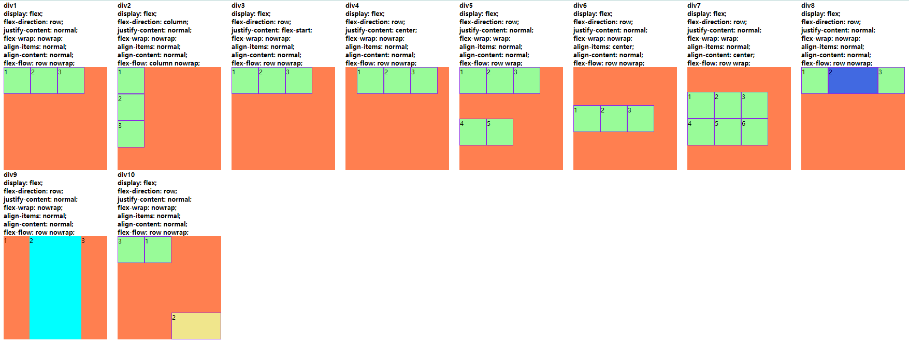
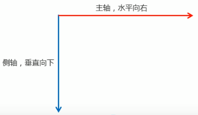

# flex弹性布局

> https://www.bilibili.com/video/BV14J4114768?p=415&vd_source=5b8a9ccdd9ef115a1b373d1e381d7760

布局简单，移动端应用广泛



### 一、flex布局原理

flex 是 flexible Box 的缩写，意为"弹性布局"，用来为盒状模型提供最大的灵活性，任何一个容器都可以指定为 flex 布局。

* 当我们为父盒子设为 flex 布局以后，子元素的 float、clear 和 vertical-align 属性将失效。
* 伸缩布局 = 弹性布局 = 伸缩盒布局 = 弹性盒布局 =flex布局

采用 Flex 布局的元素，称为 Flex 容器（flex container），简称"容器"。它的所有子元素自动成为容器成员，称为 Flex 项目（flex item），简称"项目"。


* 上述例子 div 就是 flex父容器。
* 上述例子 span 就是 子容器 flex项目
* 子容器可以横向排列也可以纵向排列

总结 flex 布局原理：`就是通过给父盒子添加 flex 属性，来控制子盒子的位置和排列方式。`

### 二、flex布局常见父项属性

以下有 6 个属性是对父元素设置的

* `flex-direction`：设置主轴的方向
* `justify-content`：设置主轴上的子元素排列方式
* `flex-wrap`：设置子元素是否换行
* `align-items`：设置侧轴上的子元素排列方式（单行）
* `align-content`：设置侧轴上的子元素的排列方式（多行）
* `flex-flow`：复合属性，相当于同时设置了 flex-direction 和 flex-wrap

#### 1、flex-direction 设置主轴方向

主轴和侧轴：在 flex 布局中，是分为主轴和侧轴两个方向，同样的叫法有：行和列、x轴和y轴

* 默认主轴方向就是 x 轴方向，水平向右
* 默认侧轴方向就是 y 轴方向，水平向下



| 属性值              | 说明       |
|------------------|----------|
| `row`            | `从左到右`（默认值） |
| `row-reverse`    | `从右到左`     |
| `column`         | `从上到下`   |
| `column-reverse` | `从下到上`     |

#### 2、justify-content 设置主轴上的子元素排列方式

| 属性值 | 说明                        |
| --- |---------------------------|
| `flex-start` | `从头部开始，如果主轴是x轴，则从左到右`（默认值）   |
| `flex-end` | `从尾部开始排列`                 |
| `center` | `在主轴居中对齐(如果主轴是 x 轴则水平居中)` |
| `space-around` | `平分剩余空间`                  |
| `space-between` | `先两边贴边，再平分剩余空间🔥`         |

#### 3、flex-wrap 设置子元素是否换行

默认情况下，项目都排在一条线（又称”轴线”）上。flex-wrap属性定义，flex布局中默认是不换行的。

意思就是如果按照我们设置的盒子大小，一行只能装 3 个盒子，但是我们有 5 个盒子，那么 flex 布局默认会给我们塞上去，自动缩小盒子大小。

| 属性值 | 说明     |
| --- |--------|
| `nowrap` | `不换行` （默认值） |
| `wrap` | `换行`   |

#### 4、align-items 设置侧轴上的子元素排列方式(单行)

该属性是控制子项在侧轴（默认是y轴）上的排列方式 在子项为单项（`单行`）的时候使用

| 属性值 | 说明 |
| --- | --- |
| `flex-start` | `从上到下` |
| `flex-end` | `从下到上` |
| `center` | `挤在一起居中(垂直居中)` |
| `stretch` | `拉伸(默认值)` |

#### 5、align-content 设置侧轴上的子元素的排列方式(多行)

设置子项在侧轴上的排列方式 并且只能用于子项出现 `换行` 的情况（多行），在单行下是没有效果的。

| 属性值 | 说明 |
| --- | --- |
| `flex-start` | `默认值在侧轴的头部开始排列` |
| `flex-end` | `在侧轴的尾部开始排列` |
| `center` | `在侧轴中间显示` |
| `space-around` | `子项在侧轴平分剩余空间` |
| `space-between` | `子项在侧轴先分布在两头，再平分剩余空间` |
| `stretch` | `设置子项元素高度平分父元素高度` |

##### align-content 和 align-items 区别

* align-items 适用于单行情况下， 只有上对齐、下对齐、居中和 拉伸
* align-content 适应于换行（多行）的情况下（单行情况下无效）， 可以设置 上对齐、 下对齐、居中、拉伸以及平均分配剩余空间等属性值。
* 总结就是单行找 align-items 多行找 align-content

#### 6、flex-flow 复合属性，相当于同时设置了 flex-direction 和 flex-wrap

flex-flow 属性是 flex-direction 和 flex-wrap 属性的复合属性

```
flex-flow: row wrap;
```

### 三、flex布局子项常见属性

* flex 子项目占的份数
* align-self 控制子项自己在侧轴的排列方式
* order属性定义子项的排列顺序（前后顺序）

#### 1、flex属性

flex 属性定义子项目`分配剩余空间`，用flex来表示占多少份数。

```
.item {
    /* default 0*/
    flex: <number>;
}
```

#### 2、align-self 控制子项自己在侧轴上的排列方式

* align-self 属性允许单个项目有与其他项目不一样的对齐方式，可覆盖 align-items 属性。
* 默认值为 auto，表示继承父元素的 align-items 属性，如果没有父元素，则等同于 stretch。

#### 3、order属性定义项目的排列顺序

数值越小，排列越靠前，默认为0。

> tips: 和 z-index 不一样。

