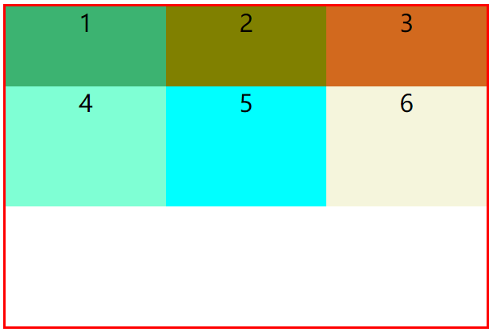

# Grid布局

Grid布局是将容器划分成“行”和“列”，产生单元格，然后指定“项目所在”的单元格，可以看作是二维布局。

### 学习资源

- [CSS Grid 布局完全指南(图解 Grid 详细教程)](https://mp.weixin.qq.com/s?__biz=MjM5MDA2MTI1MA==&mid=2649089984&idx=1&sn=ba9719bc4b1b7805c36f42470ab07cb2)
- [（超详细）强大的grid布局](https://www.jianshu.com/p/3762f214cd6f)

### 简单示例

```
.container {
    /* 设置容器布局为grid布局 */
    display: grid;
    /* 指定每一行的宽度 */
    grid-template-rows: 100px 150px;
    /* 指定每一列的宽度 */
    grid-template-columns: repeat(3, 33.33%);
}
```



---

### scss

```
// grid布局 ********************************************
.grid {
  display: grid;
}

// .grid-test {
//   display: grid; // grid布局
//   grid-auto-flow: row; // row | column | row dense | column dense; 自动布局算法依次填充 往 行/列 方向
//   // grid-template-rows: repeat(3, 1fr); // 行大小 -- 划分份数
//   // grid-template-rows: repeat(auto-fill, 30px); // 行大小 -- 自动填充
//   grid-template-columns: repeat(3, 1fr); // 列大小 -- 划分份数
//   // grid-row-gap: 50px; // 行间距
//   // grid-column-gap: 10px; // 列间距
//   grid-gap: 10px; // 行、列间距  grid-gap: <grid-row-gap> <grid-column-gap>;
//   // justify-items: stretch; // start | end | center | stretch;
//   // align-items: stretch; // start | end | center | stretch;
//   // justify-content: center; // start | end | center | stretch | space-around | space-between | space-evenly;
// }

// 设置主轴方向 x y      grid-auto-flow: row; // row | column | row dense | column dense; 自动布局算法依次填充 往 行/列 方向
$direction: (
  // 行（默认值）
  'r': row,
  // 列
  'c': column,
  // dense：告诉自动布局算法在稍后出现较小的网格项时，尝试填充网格中较早的空缺
  'rd': row dense,
  'cd': column dense
);
// 行 子元素排列方式（单独的某个具体子元素用 justify-self）    justify-items: stretch; // start | end | center | stretch;
$justify: (
  // 左侧对齐
  'start': start,
  // 水平居中对齐
  'center': center,
  // 右侧对齐
  'end': end,
  // 填满单元格的宽度（默认值）
  'stretch': stretch
);
// 列 子元素排列方式（单独的某个具体子元素用 align-self）    align-items: start | end | center | stretch;
$align: (
  // 顶部对齐
  'start': start,
  // 垂直居中对齐
  'center': center,
  // 底部对齐
  'end': flex-end,
  // 填满单元格的高度（默认值）
  'stretch': stretch
);

@each $alignKey, $alignVal in $align {
  @each $justifyKey, $justifyVal in $justify {
    @for $i from 2 through 3 {
      // grid-start-center-2
      .grid-#{$justifyKey}-#{$alignKey}-#{$i} {
        display: grid;
        // grid-gap: 10px; // 行、列间距  grid-gap: <grid-row-gap> <grid-column-gap>;
        justify-items: #{$justifyVal}; // start | end | center | stretch;
        align-items: #{$alignVal}; // start | end | center | stretch;
        grid-template-columns: repeat(#{$i}, 1fr); // 列大小 -- 划分份数
        grid-template-rows: min-content; // 行大小 -- 最小高度
      }
      // @each $directionKey, $directionVal in $direction { }
    }
  }
}

@for $i from 1 through 5 {
  // .grid-3
  .grid-#{$i} {
    display: grid;
    grid-template-columns: repeat(#{$i}, 1fr); // 列大小 -- 划分份数
  }
}

// @for $i from 20 through 50 {
//   // 如果能够被 10 整除，将应用以下样式
//   @if ($i % 10 == 0) {
//     // .grid-template-rows-30
//     .grid-template-rows-#{$i} {
//       grid-template-rows: repeat(auto-fill, #{$i}px); // 行大小 -- 指定大小后自动填充，填满后剩余区域留空
//     }
//   }
// }

@for $i from 1 through 10 {
  // 如果能够被 2 整除，将应用以下样式
  @if ($i % 2 == 0) {
    // .grid-gap-10
    .grid-gap-#{$i} {
      grid-gap: #{$i}px; // 行、列间距  grid-gap: <grid-row-gap> <grid-column-gap>;
    }
  }
}
```
