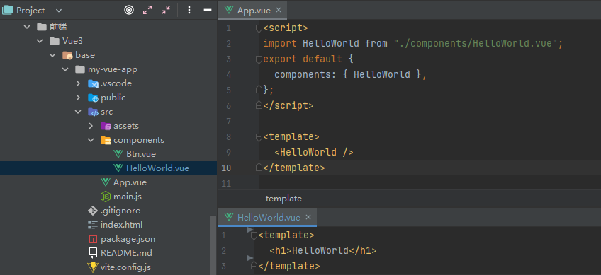

## [字符串模板组件](./11-组件.html)

## 单文件组件

### 简单示例



App.vue

```vue
<script>
import HelloWorld from "./components/HelloWorld.vue";
export default {
  components: { HelloWorld },
};
</script>

<template>
  <HelloWorld />
</template>
```

HelloWorld.vue

```vue
<template>
  <h1>HelloWorld</h1>
</template>
```

### 数据隔离

```vue
<template>
  <button
    @click="
      num++;
      msg = 1;
    "
  >
    {{ num }} -- {{ msg }}
  </button>
</template>

<script>
const msg = "hi"; // 组件全局变量
export default {
  data() {
    return {
      num: 0, // 局部变量 -- 不会造成数据污染，各不影响
      msg: msg, 
    };
  },
};
</script>
```

### 组件通信

#### 通过 `Prop` 向子组件传递数据

```vue
<script>
import HelloWorld from "./components/HelloWorld.vue";
export default {
  components: { HelloWorld },
  data() {
    return {
      name: "666",
      msg: "hello",
      list: [1, 2, 3],
    };
  },
};
</script>
<template>
`  <!-- tips: 如果是数字，需要通过动态参数传递 -->
  <HelloWorld static="静态参数" :name="name" :message="msg" :list="list" />
</template>
```

```vue
<script>
export default {
  // props: ["message", "static"],
  props: {
    static: String, // 字段类型限制 -- 如果用数字类型，会有警告
    name: String,
    message: {
      type: String,
      default: "你好", // 默认值
      required: true, // 是否必传
    },
    list: {
      type: Array,
      default() {
        // 对象或数组的默认值必须从一个工厂函数返回
        return [1];
      },
    },
  },
};
</script>
<template>
  <h1>{{ static }}</h1>
  <h1>{{ name }}</h1>
  <h1>{{ message }}</h1>
  <h1>{{ list }}</h1>
</template>
```


#### 监听子组件事件，拿到子组件数据 `$emit`

```vue
<script>
import HelloWorld from "./components/HelloWorld.vue";
export default {
  components: { HelloWorld },
  data() {
    return {
      msg: "父组件",
    };
  },
  methods: {
    getChildMsg(msg) {
      console.log(msg);
      this.msg = msg;
    },
  },
};
</script>
<template>
  <!-- 父组件中监听子组件中自定义的事件`injectMsg` -->
  <HelloWorld @injectMsg="getChildMsg" />
  <p>{{ msg }}</p>
</template>
```

```vue
<script>
export default {
  data() {
    return {
      msg: "子组件",
    };
  },
  methods: {
    sendParent() {
      // 在子组件中通过`$emit`触发父组件的事件
      // this.$emit("事件名称", "发送参数");
      this.$emit("injectMsg", this.msg);
    },
  },
};
</script>
<template>
  <button @click="sendParent">提交数据给父组件</button>
</template>
```


#### 子/父/根组件相互访问 `$refs` `$parent` `$root`

```vue
<script>
import HelloWorld from "./components/HelloWorld.vue";
export default {
  components: { HelloWorld },
  data() {
    return {
      msg: "父组件",
    };
  },
  mounted() {
    // 获取子组件中的msg属性值
    console.log(this.$refs.helloworld.msg);
  },
};
</script>
<template>
  <!-- ref: 用于给元素或子组件注册引用信息 -->
  <!-- 父组件访问子组件 `$refs` -->
  <!-- 子组件访问父组件 `$parent` -->
  <!-- 子组件访问根组件 `$root` -->
  <HelloWorld ref="helloworld" />
</template>
```

```vue
<script>
export default {
  data() {
    return {
      msg: "子组件",
    };
  },
  mounted() {
    // 获取父组件中的msg属性值
    console.log(this.$parent.msg);
    // 获取根组件中的msg属性值
    console.log(this.$root.msg);
  },
};
</script>
<template>
  <button>click</button>
</template>
```

### 组件跨级通信 `provide` `inject`

> 父子组件之间深度嵌套

`provide`: 父组件提供数据
`inject`: 子组件接收数据&使用

App.vue

```vue
<script>
import HelloWorld from "./components/HelloWorld.vue";
export default {
  components: { HelloWorld },
  data() {
    return {
      msg: "hi",
      msgObj: {
        msg: "hi",
      },
    };
  },
  // 固定值
  // provide: { msg: "hello" },
  // 访问组件实例的属性
  provide() {
    return {
      // msg: this.msg, // -- 孙子组件中的值不会同步更新
      msgObj: this.msgObj, // 响应式对象方式
      msg: () => this.msg, // 函数返回响应式数据
    };
  },
};
</script>
<template>
  <!-- <p>祖先组件：{{ msgObj.msg }}</p>
  <button @click="msgObj.msg = 'hello1'">change</button>
  <HelloWorld />
  <hr /> -->
  <p>祖先组件：{{ msg }}</p>
  <button @click="msg = 'hello2'">change</button>
  <HelloWorld />
</template>
```

HelloWorld.vue

```vue
<script>
import Btn from "./Btn.vue";
export default {
  components: { Btn },
};
</script>
<template>
  <Btn />
</template>
```

Btn.vue

```vue
<template>
  <!-- <button>孙子组件：{{ msg }}</button> -->
  <!-- <button>孙子组件：{{ msgObj.msg }}</button> -->
  <!-- <button>孙子组件：{{ msg() }}</button> -->
  <button>孙子组件：{{ newMsg }}</button>
</template>
<script>
export default {
  computed: {
    newMsg() {
      return this.msg();
    },
  },
  // inject: ["msg"],
  inject: ["msg", "msgObj"],
};
</script>
```