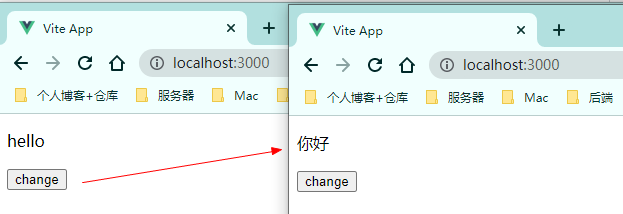

`my-vue-app/src/store/index.js`

```js
// 状态集中管理 -- 统一数据修改出入口
import { reactive } from "vue";
const store = {
  state: reactive({
    msg: "hello",
  }),
  updateMsg: function () {
    this.state.msg = "你好";
  },
};

export default store;
```

> 从父组件中引入`store`，所有子组件中均可使用其中的数据

`my-vue-app/src/App.vue`

```vue
<script setup>
import HelloWorld from "./components/HelloWorld.vue";
import store from "./store";
import { provide } from "vue";
provide("store", store);
</script>
<template>
  <HelloWorld />
</template>
```

`my-vue-app/src/components/HelloWorld.vue`

```vue
<template>
  <p>{{ store.state.msg }}</p>
  <button @click="changeMsg">change</button>
</template>
<script setup>
import { inject } from "vue";
const store = inject("store");
function changeMsg() {
  store.updateMsg();
}
</script>
```

