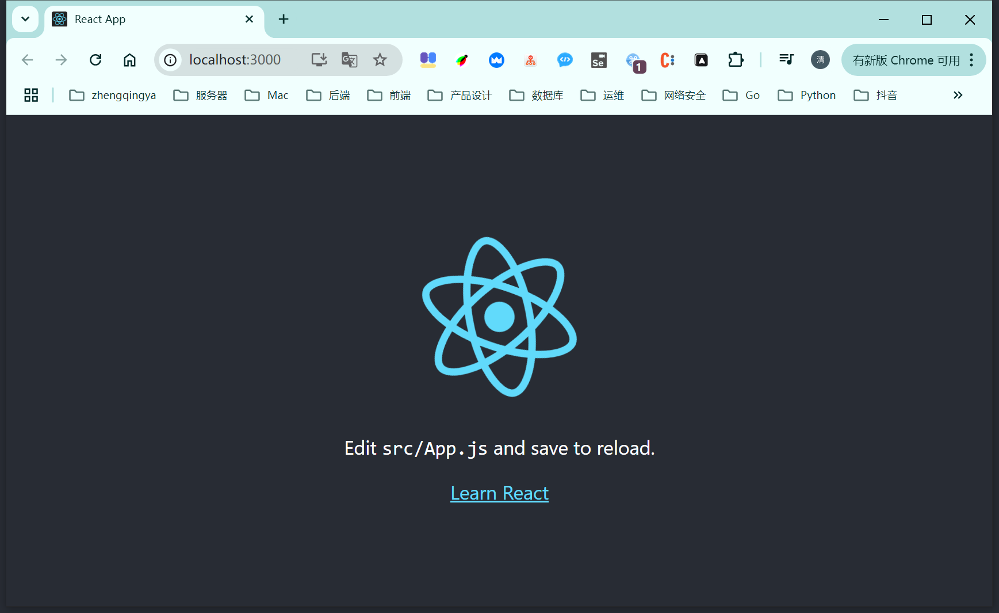
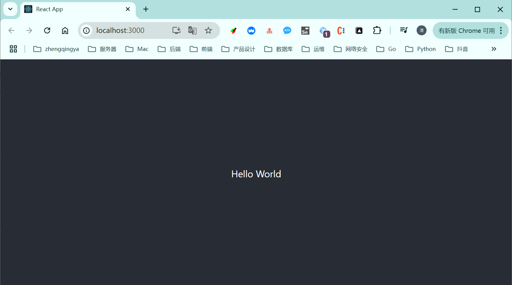

# 初始化项目

> https://react.docschina.org/learn/start-a-new-react-project

环境：
- node：v16.18.0
- npm：8.19.2
- cnpm：9.4.0

### 第一个React项目

```shell
# 创建项目
# npx create-react-app my-react-app
# 或
cnpm install -g create-react-app
create-react-app my-react-app

# 进入项目目录
cd my-react-app
# 运行项目
npm start
```




### 项目结构


```
my-react-app/
├── node_modules/  # 包含项目依赖的所有 npm 包。这些包是通过 package.json 文件中定义的依赖项自动安装的。
├── public/
│   ├── favicon.ico     # 浏览器标签上的小图标。
|   ├── index.html      # 这是应用程序的 HTML 模板文件。React 应用程序将被挂载到此文件中的 <div id="root"></div> 元素。
|   ├── manifest.json   # 用于定义和配置渐进式 Web 应用（PWA，Progressive Web App）的行为和元数据。它使得应用程序可以在现代浏览器中以类似原生应用的方式运行，提供更好的用户体验。
|   ├── robots.txt      # 用于指导搜索引擎爬虫（如 Googlebot、Bingbot 等）如何抓取和索引网站的内容。它位于网站的根目录下，通过一组规则告诉爬虫哪些页面或资源可以抓取，哪些应该被忽略。
├── src/
│   ├── app.js              # 主组件文件，定义了应用程序的主要 UI 结构。
│   ├── app.css             # 与 App.js 配套的样式文件。
│   ├── index.js            # 入口文件，负责渲染整个应用程序到 DOM 中。
│   ├── index.css           # 定义全局样式，它会影响整个应用程序的外观和布局。
│   ├── logo.svg            # 默认的应用程序 logo 图像。
│   ├── App.test.js         # 用于编写和运行针对 App.js 组件的单元测试。
│   ├── reportWebVitals.js  # 用于报告性能指标的实用工具函数。
│   ├── setupTests.js       # 为 Jest 测试框架设置全局环境。
├── .gitignore              # 指定了哪些文件和目录不应被 Git 版本控制系统跟踪。
├── package.json            # 定义了项目的元数据（如名称、版本）、依赖项、脚本命令（eg：`start`、`build`、`test`）等信息。
├── package-lock.json       #  npm（Node Package Manager）生成的一个锁定文件，用于确保项目依赖的一致性和可重复性。
└── README.md               # 包含项目的简要说明，默认情况下会有一些关于如何运行项目的提示。
```

### 简单修改

`src/app.js` 是主组件文件，定义了一个基础的 React 组件。
我们可以来尝试简单修改下

```js
import "./App.css";

function App() {
  return (
    <div className="App">
      <header className="App-header">Hello World</header>
    </div>
  );
}

export default App;
```

查看浏览器效果

