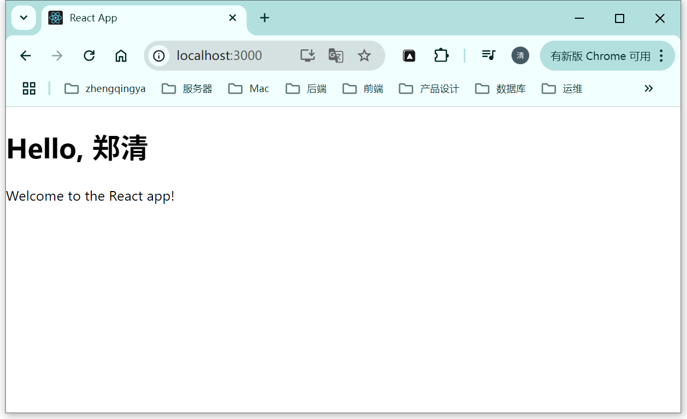

# JSX

JSX 是 React 中的一种语法扩展，它允许你在 JavaScript 中编写类似 HTML 的代码。
JSX 并不是必需的，但它是构建 React 组件时最常用的语法，因为它使得模板代码更加直观和易读。

### 一、JSX 基本语法

#### 1. 元素结构

JSX 元素看起来像 HTML 标签，但实际上它们会被编译成 `React.createElement()` 调用。

```jsx
const element = <h1>Hello, world!</h1>;
```

#### 2. 属性 (Attributes)

- 使用驼峰命名法（`camelCase`）来定义属性名。
- 使用大括号 `{}` 来嵌入 JavaScript 表达式。

```jsx
const greeting = 'Hello';
const element = <h1 className="greeting">{greeting}, world!</h1>;
```

#### 3. 嵌套元素

你可以像在 HTML 中一样嵌套 JSX 元素：

```jsx
const element = (
  <div>
    <h1>Hello, world!</h1>
    <p>Welcome to my app.</p>
  </div>
);
```

#### 4. 自闭合标签

空元素必须使用自闭合标签：

```jsx
const element = ;
```

#### 5. 注释

在 JSX 中添加注释需要使用大括号包裹注释内容：

```jsx
const element = (
  <div>
    {/* 这是一个注释 */}
    <h1>Hello, world!</h1>
  </div>
);
```


### 二、JSX 表达式

你可以在 JSX 中嵌入 JavaScript 表达式，只需将表达式放在大括号 `{}` 中。

```jsx
function formatName(user) {
  return user.firstName + ' ' + user.lastName;
}

const user = {
  firstName: 'Alice',
  lastName: 'Smith'
};

const element = (
  <h1>Hello, {formatName(user)}!</h1>
);
```

### 三、条件渲染

你可以使用条件运算符或逻辑运算符来控制是否渲染某些元素。

```jsx
const isLoggedIn = true;

const element = (
  <div>
    {isLoggedIn ? <h1>Welcome back!</h1> : <h1>Please sign in.</h1>}
  </div>
);
```

### 四、列表渲染

使用数组的 `map()` 方法来生成列表项，并为每个元素提供唯一的 `key` 属性。

```jsx
const numbers = [1, 2, 3, 4, 5];

const listItems = numbers.map((number) => (
  <li key={number.toString()}>{number}</li>
));

const element = (
  <ul>{listItems}</ul>
);
```

### 五、JSX 中的样式

你可以通过 `style` 属性传递内联样式对象。注意样式属性名使用驼峰命名法。

```jsx
const styles = {
  backgroundColor: 'blue',
  color: 'white',
  padding: '10px'
};

const element = <div style={styles}>Styled div</div>;
```

### 六、JSX 和普通 JavaScript 的区别

- `HTML 属性`：JSX 使用 `className` 而不是 `class`，因为 `class` 是 JavaScript 的保留字。
- `事件处理`：事件名称使用驼峰命名法（eg：`onClick`），并且事件处理器是函数而不是字符串。
- `JavaScript 表达式`：在 JSX 中可以嵌入任意 JavaScript 表达式，但不能使用语句（如 `if` 或 `for`）。

### 七、示例：完整的 JSX 组件

```jsx
import React from "react";

function Welcome(props) {
    return <h1>Hello, {props.name}</h1>;
}

function App() {
    const name = "郑清";
    return (
        <div>
            <Welcome name={name} />
            <p>Welcome to the React app!</p>
        </div>
    );
}

export default App;
```



### 八、总结

JSX 是一种简洁且直观的语法，用于在 React 中编写组件模板。
它结合了 HTML 的易读性和 JavaScript 的灵活性，使得开发人员能够更高效地构建用户界面。
