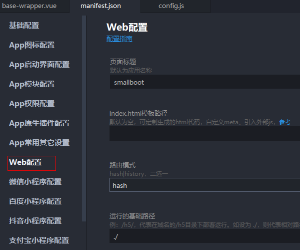

# uniapp之h5打包部署

`manifest.json` 配置




```json
{
    "h5" : {
        "devServer" : {
            "https" : false,
            "port" : 5100
        },
        "sdkConfigs" : {
            "maps" : {}
        },
        "title" : "smallboot",
        "router" : {
            "mode" : "hash",
            "base" : "./"
        }
    }
}
```

`HBuilder X` -> `发行` -> `h5`


将导出的整个h5目录放到nginx中的`/usr/share/nginx/html`目录下，再通过`域名/h5/#/`即可访问

> tips：如果涉及微信授权回调，不要使用hash模式，使用history模式，即路径不带`/#/`
