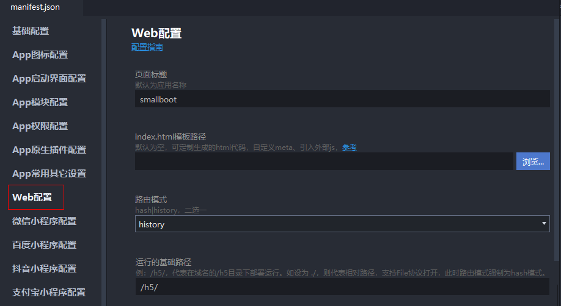
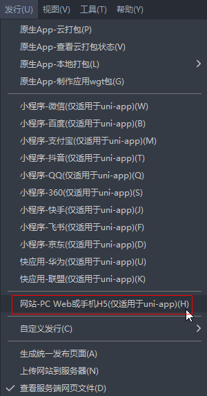
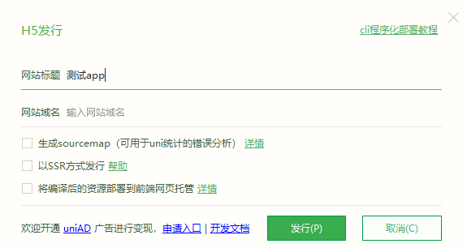
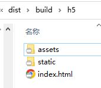

# uniapp之h5打包部署

`manifest.json` 配置



> tips：如果涉及微信授权回调，不要使用hash模式，使用history模式，即路径不带`/#/`

```json
{
  "h5" : {
    "devServer" : {
      "https" : false,
      "port" : 5100
    },
    "sdkConfigs" : {
      "maps" : {}
    },
    "title" : "smallboot",
    "router" : {
      "mode" : "history",
      "base" : "/h5/"
    }
  }
}
```

`HBuilder X` -> `发行` -> `h5`





将导出的整个h5目录下的文件放到nginx中的`/usr/share/nginx/html`目录下，再通过`域名/h5/`即可访问


```
location / {
    root   /usr/share/nginx/html;
    index  index.html index.htm;
    try_files $uri $uri/ /index.html; # 解决页面刷新 404 问题
}
```

### nginx代理配置 -- 访问子目录

tips: 这里是将打包好的h5目录下的文件放在nginx中的`/usr/share/nginx/html/h5`目录下，再通过`域名/h5/`即可访问

```
# 子目录访问
location /h5 {
    alias   /usr/share/nginx/html/h5;
    index  index.html index.htm;
    try_files $uri $uri/ /h5/index.html; # 解决页面刷新 404 问题
}
```

