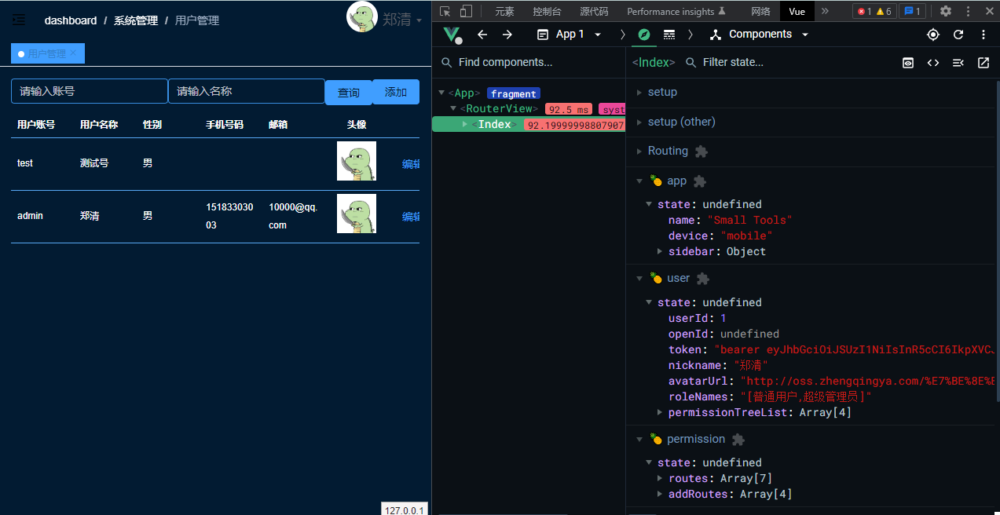

### 方式一：`debugger`

1. 代码中添加`debugger`
2. 浏览器`F12` 即可进入调试

```js
methods: {
    async refreshTableData() {
      debugger
      this.$refs.baseTable.refresh()
    }
}
```

### 方式二：vscode


`launch.json`

> 有个这个文件后，可直接在vscode中F5打开当前服务

```json
{
  "version": "0.2.0",
  "configurations": [
    {
      "type": "pwa-chrome",
      "request": "launch",
      "name": "Launch Chrome against localhost",
      "url": "http://127.0.0.1:5173",
      "webRoot": "${workspaceFolder}"
    }
  ]
}
```

### 方式三：谷歌插件`Vue.js devtools`

> https://chrome.google.com/webstore/detail/vuejs-devtools/ljjemllljcmogpfapbkkighbhhppjdbg



### 方式四：浏览器F12 -> 源代码中直接debug

