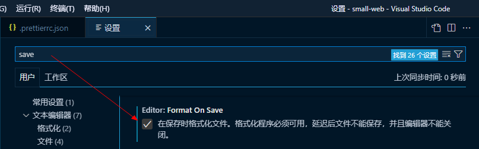
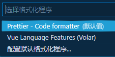

# 代码格式化

Prettier：代码格式化工具

- https://github.com/prettier/prettier
- https://prettier.io/

### 一、vscode安装插件


### 二、安装 prettier

```shell
cnpm install --save-dev --save-exact prettier
cnpm install eslint --save-dev
```

### 三、配置

#### 1、[.prettierrc.json](../.prettierrc.json) 格式化配置文件

> https://prettier.io/docs/en/configuration.html

可以在 https://prettier.io/playground/ 中测试效果，然后拷贝配置内容到自己的项目中

```json
{
  "arrowParens": "always",
  "bracketSameLine": true,
  "bracketSpacing": true,
  "semi": true,
  "singleQuote": true,
  "jsxSingleQuote": false,
  "quoteProps": "as-needed",
  "trailingComma": "all",
  "singleAttributePerLine": false,
  "htmlWhitespaceSensitivity": "css",
  "vueIndentScriptAndStyle": false,
  "proseWrap": "preserve",
  "insertPragma": false,
  "requirePragma": false,
  "useTabs": false,
  "embeddedLanguageFormatting": "auto",
  "tabWidth": 2,
  "printWidth": 200
}
```

#### 2、[.prettierignore](../.prettierignore) 忽略格式化文件

```
/dist/*
/node_modules/**
**/*.svg
/public/*
```

#### 3、保存时自动格式化代码



#### 4、右击选择 `使用...格式化文档` -> 配置默认格式化方式



### 四、统一代码风格

> 需安装插件`EditorConfig for VS Code`
> 


.editorconfig 是一个配置文件，用于统一编辑器的格式化规则和代码风格。它可以帮助团队成员在不同的编辑器中编写代码时保持一致的格式。

.editorconfig 文件通常放置在项目根目录下，它使用简单的键值对格式来指定编辑器的规则，例如缩进大小、换行符类型、文件编码等。

[.editorconfig](../.editorconfig)

```
# https://editorconfig.org
# 根目录配置，表示当前目录是编辑器配置的根目录
root = true

[*] # 对所有文件应用以下配置
charset = utf-8 # 使用 UTF-8 编码
indent_style = space # 使用空格进行缩进
indent_size = 2 # 每个缩进级别使用 2 个空格
end_of_line = lf # 使用 LF（Linux 和 macOS 的换行符）
insert_final_newline = true # 在文件末尾插入一行空白
trim_trailing_whitespace = true # 自动删除行末尾的空白字符

[*.md] # 对扩展名为 .md 的 Markdown 文件应用以下配置
insert_final_newline = false # 不在文件末尾插入一行空白
trim_trailing_whitespace = false # 不自动删除行末尾的空白字符
```

配置后，在文件格式如下 
Ctrl+S 保存后会变成如下

