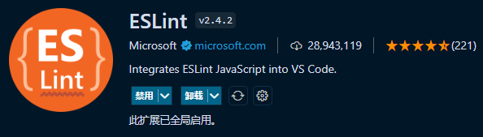
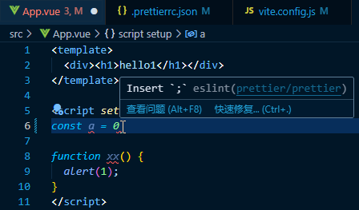

# ESLint

https://github.com/eslint/eslint

可参考：

- [vue3+vite项目配置ESlint](https://blog.csdn.net/weixin_43422861/article/details/127378156)
- [vue3+vite项目配置ESlint、pritter插件](https://blog.csdn.net/ACCPluzhiqi/article/details/132136727)
- [从项目规范（eslint + prettier）到自动化配置](https://juejin.cn/post/6954150918086475806)

### 一、安装

```shell
# eslint => ESLint的核心代码
# prettier => prettier插件的核心代码
# eslint-plugin-vue => 为 Vue 使用 ESlint 的插件
# eslint-config-prettier => 解决ESLint中的样式规范和prettier中样式规范的冲突，以prettier的样式规范为准，使ESLint中的样式规范自动失效
# eslint-plugin-prettier => 将prettier作为ESLint规范来使用
cnpm install --D eslint prettier eslint-plugin-vue eslint-config-prettier eslint-plugin-prettier          
```



### 二、配置编码规范检查

#### 1、[.eslintrc.cjs](../.eslintrc.cjs)

```
module.exports = {
  root: true,
  env: {
    browser: true,
    es2021: true,
    node: true,
  },
  extends: ['eslint:recommended', 'plugin:vue/vue3-recommended', 'prettier'],
  overrides: [],
  parserOptions: {
    ecmaVersion: 'latest',
    sourceType: 'module',
  },
  plugins: ['vue', 'prettier'],
  rules: {
    'prettier/prettier': 'error',
    'vue/multi-word-component-names': 'off',
    'vue/no-v-model-argument': 'off',
  },
};
```

##### 规则配置

> 规则中文解释 http://eslint.cn/docs/rules/

```
rules: {
  '规则名': '规则值'
  // eg:
  'no-undef': 'off'
}
```

规则值:

- "off"或者0 => 关闭检测规则
- "warn"或者1 => 打开并把打开的检测规则作为警告（不影响退出代码）
- "error"或者2 => 打开并把检测规则作为一个错误（退出代码触发时为1）

#### 2、[.eslintignore](../.eslintignore) 忽略检查

```
node_modules
*.md
.vscode
.idea
dist
public
*.js
*.cjs
```

### 三、配置vite项目启动时检查

```shell
cnpm install -D vite-plugin-eslint
```

[vite.config.js](../vite.config.js)

```
import { defineConfig } from "vite";
import vue from "@vitejs/plugin-vue";

import eslint from "vite-plugin-eslint";

// https://vitejs.dev/config/
export default defineConfig({
  plugins: [
    vue(),
    eslint({ lintOnStart: true, cache: false }), // 项目运行时进行eslint检查
  ],
});
```

### 四、检验

> tips: 如果vscode中没有效果，可以尝试重启vscode看看。



