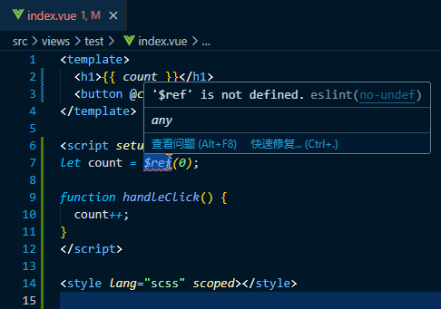

# $ref语法糖 告别 .value

### 一、配置

#### 法一

> vue3.4版本之后废除
> 

[`vite.config.js`](../vite.config.js)

```
import { defineConfig } from 'vite'
import vue from '@vitejs/plugin-vue'

export default defineConfig({
  plugins: [
    vue({
      reactivityTransform: true, // 启用响应式语法糖 $ref $computed $toRef ...
    })
  ]
})
```

#### 法二

https://vue-macros.sxzz.moe/zh-CN/features/reactivity-transform.html

> tips: store(pinia版) 中使用 `$ref` 无法正常持久化数据！！！

```shell
cnpm i -D @vue-macros/reactivity-transform
```

[`vite.config.js`](../vite.config.js)

```
import { defineConfig } from 'vite'
import vue from '@vitejs/plugin-vue'
import ReactivityTransform from '@vue-macros/reactivity-transform/vite';

export default defineConfig({
  plugins: [
    vue(),
    ReactivityTransform(), // 启用响应式语法糖 $ref ...
  ]
})
```

#### 解决ESLint警告: '$ref' is not defined.



[.eslintrc.cjs](../.eslintrc.cjs)

```
module.exports = {
  globals: { $ref: 'readonly', $computed: 'readonly', $shallowRef: 'readonly', $customRef: 'readonly', $toRef: 'readonly' },
};
```

### 二、测试

原本 .value 响应式

```
<template>
  <h1>{{ count }}</h1>
  <button @click="handleClick">click</button>
</template>

<script setup>
let count = ref(0);

function handleClick() {
  count.value++;
}
</script>
```

现在 $ref 去除 .value

```
<template>
  <h1>{{ count }}</h1>
  <button @click="handleClick">click</button>
</template>

<script setup>
let count = $ref(0);

function handleClick() {
  count++;
}
</script>
```
