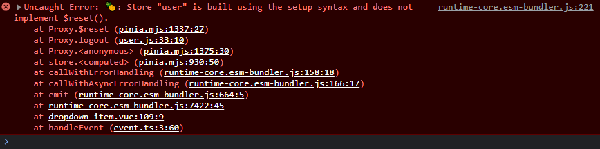

# Pinia

> https://pinia.vuejs.org/zh/

### 一、安装

```shell
cnpm install pinia
```

### 二、配置

[src/main.js](../src/main.js)

```
// pinia
import { createPinia } from 'pinia';
const pinia = createPinia();
app.use(pinia);
// store
import store from '@/store';
app.config.globalProperties.$store = store;
```

### 三、使用

[src/store/index.js](../src/store/index.js)

> store模块化

```
// 拿到modules下的所有文件
const modulesFiles = import.meta.globEager('./modules/*.*');
const modules = {};
for (const key in modulesFiles) {
  const moduleName = key.replace(/(.*\/)*([^.]+).*/gi, '$2');
  const value = modulesFiles[key];
  modules[moduleName] = value;
  // console.log(modules);
}

export default modules;
```

[src/store/modules/test.js](../src/store/modules/test.js)

```
import { defineStore } from 'pinia';

export const useCounterStore = defineStore('test', () => {
  const count = ref(0);
  function increment() {
    count.value++;
  }
  return { count, increment };
});
```

### 四、测试

```
<template>
  <h1>{{ count }}</h1>
  <button @click="handleClick">click</button>
  <br />
  <h1>{{ $store.test.useTestStore().count }}</h1>
  <button @click="$store.test.useTestStore().add">click</button>
</template>

<script setup>
const { proxy } = getCurrentInstance();
let useTestStore = proxy.$store.test.useTestStore();
let { count } = toRefs(useTestStore); // 响应式
let { add } = useTestStore;

function handleClick() {
  add();
}
</script>

<style lang="scss" scoped></style>
```

### 五、持久化存储 `pinia-plugin-persistedstate`

上面的配置浏览器一刷新数据就丢了，所以配置下持久化存储。

https://prazdevs.github.io/pinia-plugin-persistedstate/zh/

```
cnpm i pinia-plugin-persistedstate
```

[src/main.js](../src/main.js)

```
// 持久化存储
import { createPersistedState } from 'pinia-plugin-persistedstate';
pinia.use(
  createPersistedState({
    auto: true, // 启用所有 Store 默认持久化
  }),
);
```

#### tips: pinia持久化的无法通过 `window.localStorage.clear();` 一键清空数据

```js
window.localStorage.setItem('user2', 'hello');
// window.localStorage.removeItem('user2');

// tips: pinia持久化的无法通过这种方式清空数据，只能删除同样方式存储的值 eg: window.localStorage.setItem('user2', 'hello');
window.localStorage.clear();
window.sessionStorage.clear();
```

#### $reset() 清空数据

> https://pinia.vuejs.org/zh/core-concepts/state.html#resetting-the-state

```
import store from '@/store';

// 退出登录
function logout() {
  isLogin.value = false;
  // 清空当前store在pinia中持久化存储的数据
  this.$reset();
  
  // 其它store
  store.settings.useSettingsStore().$reset();
  
  // 最终真正清空storage数据
  window.localStorage.clear();
  window.sessionStorage.clear();
}
```

组合式api中直接使用 $reset() 会报如下错：



解决：

1. 改用选项式api
2. 重写 $reset 方法

[src/main.js](../src/main.js)

```
// 重写 $reset 方法 => 解决组合式api中无法使用问题
pinia.use(({ store }) => {
  const initialState = JSON.parse(JSON.stringify(store.$state));
  store.$reset = () => {
    store.$patch(initialState);
  };
});
```
