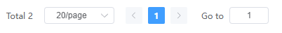

# Element Plus 分页组件英文问题

### 一、问题



### 二、解决

> https://element-plus.org/zh-CN/guide/i18n.html


```
<template>
  <el-config-provider :locale="zhCn">
    <el-pagination
      v-if="res && res.total > 0"
      :current-page="pageParams.pageNum"
      :page-size="pageParams.pageSize"
      :total="res.total == null ? 0 : res.total"
      :small="true"
      :page-sizes="[10, 20, 30, 40, 50]"
      :background="true"
      layout="total, sizes, prev, pager, next, jumper, slot"
      @size-change="handleSizeChange"
      @current-change="handleCurrentChange" />
  </el-config-provider>
</template>
<script setup>
import zhCn from 'element-plus/dist/locale/zh-cn.mjs';
zhCn.el.pagination = {
  goto: '前往',
  pageClassifier: '页',
  pagesize: '条/页',
  total: '共{total}条数据',
};
</script>
```