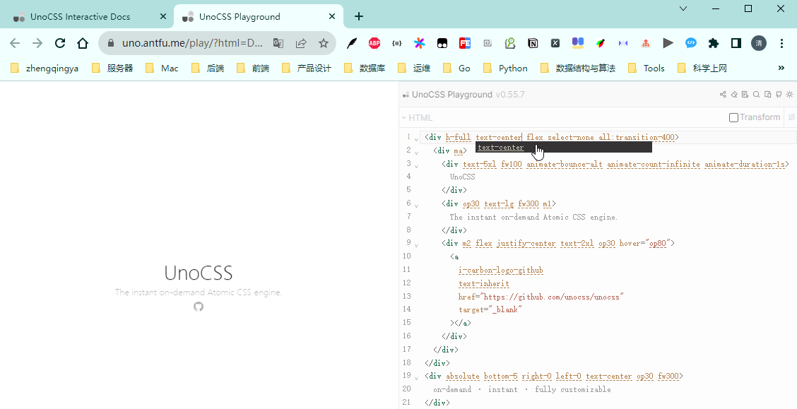
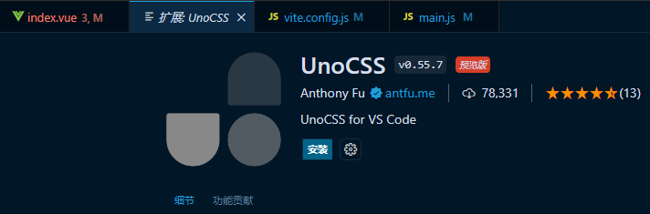
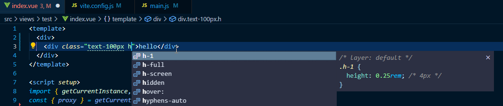
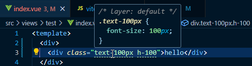

# UnoCSS

- https://github.com/unocss/unocss
- https://unocss.dev
- [了解UnoCss - 重新构想原子化 CSS](https://antfu.me/posts/reimagine-atomic-css-zh)
- [unocss小程序预设，在 taro uniapp 原生小程序 中使用unocss](https://github.com/MellowCo/unocss-preset-weapp)

### 一、前言

#### 效果预览

https://uno.antfu.me/play



#### 样式查询

https://unocss.dev/interactive/?s=red


#### 图标查询

https://icones.js.org/


---

### 二、使用

```shell
# @unocss/preset-uno：工具类预设
# @unocss/preset-attributify：属性化模式支持
# @unocss/preset-icons：icon支持
# @unocss/preset-rem-to-px：Rem 转 px 预设
cnpm i -D unocss @unocss/preset-uno @unocss/preset-attributify @unocss/preset-icons @unocss/preset-rem-to-px
```

[vite.config.js](../vite.config.js)

```
import { defineConfig } from 'vite'
// 引入UnoCSS
import UnoCSS from 'unocss/vite';
import { presetUno, presetAttributify, presetIcons } from 'unocss';
import presetRemToPx from '@unocss/preset-rem-to-px';

export default defineConfig({
  plugins: [
    vue(),
    UnoCSS({
        presets: [
          presetUno(),
          presetAttributify(),
          presetIcons(),
          presetRemToPx({
            // 1单位 = 4px -- 如果CSS中没有设置HTML的font-size，那么浏览器默认的字号是16px。 16px / 4px => 1rem = 4px
            baseFontSize: 4,
          }),
        ],
        // 自定义规则 https://unocss.dev/config/rules
        // rules: [['m-1', { margin: '1px' }]],
      }),
  ],
})
```

[main.js](../src/main.js)

```
// UnoCSS
import 'virtual:uno.css';
```

使用

```
<div
  class="text-center m-a w-200 h-200 text-100px lh-200px color-red"
  bg="blue-400 hover:blue-500 dark:blue-500 dark:hover:blue-600"
  text="lg white"
  font="mono light"
  p="y-2 x-4"
  border="2 rounded blue-200">
  hello world
</div>
```

### 三、vscode插件 -- UnoCSS -- 代码预览提示

https://unocss.dev/integrations/vscode






### 四、其它

#### 预设

https://unocss.dev/presets/

| Package                                                              | Description                     |
|:---------------------------------------------------------------------|:--------------------------------|
| [@unocss/preset-uno](https://unocss.dev/presets/uno)                 | 默认预设(现在它相当于@unocss/preset-wind) |
| [@unocss/preset-mini](https://unocss.dev/presets/mini)               | 最小但重要的规则和变体                     |
| [@unocss/preset-wind](https://unocss.dev/presets/wind)               | Tailwind / Windi CSS 紧凑预设       |
| [@unocss/preset-attributify](https://unocss.dev/presets/attributify) | 为其他预设和规则提供属性模式                  |
| [@unocss/preset-tagify](https://unocss.dev/presets/tagify)           | 为其他规则启用标记模式                     |
| [@unocss/preset-icons](https://unocss.dev/presets/icons)             | 由 Iconify 提供支持的纯 CSS 图标解决方案     |
| [@unocss/preset-web-fonts](https://unocss.dev/presets/web-fonts)     | 网络字体（Google Fonts等）支持           |
| [@unocss/preset-typography](https://unocss.dev/presets/typography)   | 排版预设                            |
| [@unocss/preset-rem-to-px](https://unocss.dev/presets/rem-to-px)     | 将 rem 转换为 px 以供 utils 使用        |

