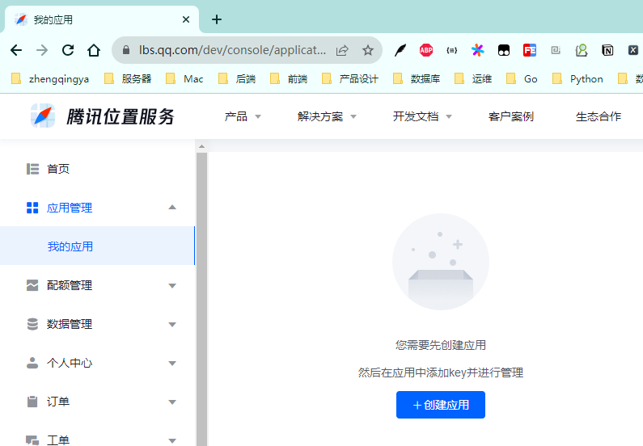
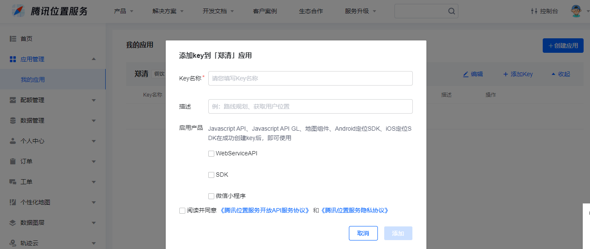

# 引入腾讯地图

> 可参考：https://lbs.qq.com/webApi/javascriptGL/glGuide/glBasic

### 一、注册账号

https://lbs.qq.com/

### 二、创建应用

https://lbs.qq.com/dev/console/application/mine



添加key


### 三、简单使用

[index.html](../index.html)

```
<script charset="utf-8" src="https://map.qq.com/api/gljs?v=1.exp&key=填写自己申请的KEY"></script>
```

页面应用

```
<template>
  <div id="container" style="width: 500px; height: 500px"></div>
</template>
<script setup>
const { proxy } = getCurrentInstance();

defineExpose({
  initMap,
});

onMounted(() => {
  initMap({ lat: 30.56079, lng: 104.07483 });
});

function initMap({ lat, lng }) {
  var center = new TMap.LatLng(lat, lng);
  // 初始化地图
  var map = new TMap.Map(document.getElementById('container'), {
    rotation: 0, // 设置地图旋转角度
    pitch: 30, // 设置俯仰角度（0~45）
    zoom: 13, // 设置地图缩放级别
    center: center, // 设置地图中心点坐标
  });
}
</script>
<style lang="scss" scoped></style>
```

### 四、获取IP定位

> https://lbs.qq.com/service/webService/webServiceGuide/webServiceIp

访问请求 https://apis.map.qq.com/ws/location/v1/ip?ip=171.217.104.29&key=填写自己申请的KEY

```json
{
  "status": 0,
  "message": "Success",
  "request_id": "d6dcbd60e77b49fb9a049d15bdddec85",
  "result": {
    "ip": "171.217.104.29",
    "location": {
      "lat": 30.64242,
      "lng": 104.04311
    },
    "ad_info": {
      "nation": "中国",
      "province": "四川省",
      "city": "成都市",
      "district": "武侯区",
      "adcode": 510107,
      "nation_code": 156
    }
  }
}
```
