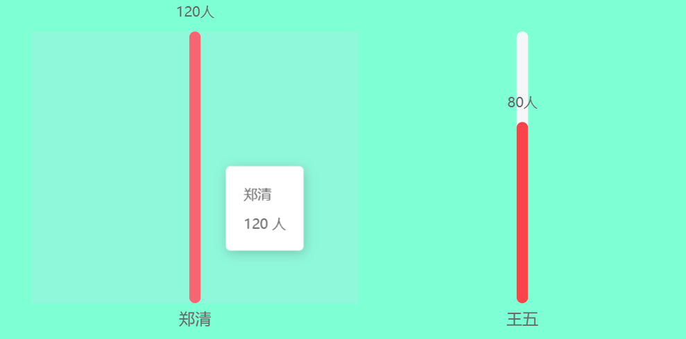

# 引入vue-echarts

安装依赖

```shell
cnpm install vue-echarts echarts
# dependencies:
# + vue-echarts ^7.0.3
# + echarts ^5.6.0
```

main.js

```js
// 引入 Echarts 5.x
import * as echarts from 'echarts';

app.use(echarts);
// 引入vue-echarts
import ECharts from 'vue-echarts';

app.component('v-chart', ECharts);
```

使用示例：

```
<template>
  <div style="height: 300px; width: 600px; background-color: aquamarine">
    <v-chart autoresize :option="chartOption" />
  </div>
</template>
<script setup>
import { ref, computed, onMounted } from 'vue';
import { use } from 'echarts/core';
import { CanvasRenderer } from 'echarts/renderers';
import { BarChart } from 'echarts/charts';
import { GridComponent, TooltipComponent, DataZoomComponent } from 'echarts/components';
import VChart from 'vue-echarts';

// 注册必要的组件
use([CanvasRenderer, BarChart, GridComponent, TooltipComponent, DataZoomComponent]);

onMounted(async () => {
  initData();
});

let maxValue = $ref(0);
let dataList = $ref([]);
let initialEndPercent = $ref(0);

async function initData() {
  // mock数据
  dataList = [
    { name: '郑清', value: 120 },
    { name: '王五', value: 80 },
  ];

  if (dataList.length > 0) {
    maxValue = Math.max(...dataList.map((item) => item.value)); // 最大值用于计算进度条宽度比例
    initialEndPercent = (12 / dataList.length) * 100; // 计算初始显示的数据数量
  }
}

// 图表配置
const chartOption = computed(() => ({
  grid: {
    left: '0px',
    right: '0px',
    bottom: '10px', // 设置50px: 可为dataZoom留出空间
    top: '30px',
    containLabel: true,
  },
  tooltip: {
    trigger: 'axis',
    axisPointer: {
      type: 'shadow',
    },
    formatter: function (params) {
      // 获取当前柱状图的数据
      const item = params[1]; // 第二个series是数据柱状图
      const name = dataList[item.dataIndex].name; // 获取完整名称
      const value = item.value;

      // 返回格式化的提示内容
      return `
        <div style="padding: 3px 5px; font-size: 12px;">
          <div>${name}</div>
          <div style="margin-top: 5px;">${value} 人</div>
        </div>
      `;
    },
  },
  xAxis: {
    type: 'category',
    data: dataList.map((item) => item.name),
    axisLine: { show: false },
    axisTick: { show: false },
    axisLabel: {
      show: true,
      interval: 0,
      fontSize: 14,
      color: 'rgba(102, 102, 102, 1)',
      margin: 8,
      formatter: function (value) {
        // 限制显示长度为3个字符，超出部分用...替代
        if (value.length > 3) {
          return value.substring(0, 3) + '...';
        }
        return value;
      },
    },
  },
  yAxis: {
    type: 'value',
    show: false,
    max: 'dataMax',
    splitLine: { show: false },
  },
  // 数据缩放组件配置
  dataZoom: [
    {
      type: 'slider', // 底部滑动条
      show: false, // 隐藏底部滑动条
      xAxisIndex: [0],
      start: 0,
      end: initialEndPercent,
      height: 20,
      bottom: 10,
      borderColor: 'transparent',
      backgroundColor: '#f5f6fa',
      fillerColor: 'rgba(251, 67, 74, 0.1)',
      handleIcon: 'path://M306.1,413c0,2.2-1.8,4-4,4h-59.8c-2.2,0-4-1.8-4-4V200.8c0-2.2,1.8-4,4-4h59.8c2.2,0,4,1.8,4,4V413z',
      handleSize: '110%',
      handleStyle: {
        color: '#fb434a',
      },
      textStyle: {
        color: '#999',
      },
      moveHandleSize: 0, // 鼠标移动手柄尺寸
    },
    {
      type: 'inside', // 内置缩放 - 允许鼠标滚轮缩放
      xAxisIndex: [0],
      start: 0,
      end: initialEndPercent,
      zoomOnMouseWheel: true,
      moveOnMouseWheel: true,
    },
  ],
  series: [
    // 背景条形图
    {
      type: 'bar',
      data: dataList.map(() => Math.max(maxValue, 1)), // 使用最大值作为背景高度
      itemStyle: {
        color: '#f5f6fa',
        borderRadius: [10, 10, 10, 10],
      },
      barWidth: 10,
      barGap: '-100%',
      z: 1,
      silent: true,
      animation: false,
    },
    // 数据条形图
    {
      type: 'bar',
      data: dataList.map((item) => item.value),
      barWidth: 10,
      itemStyle: {
        color: '#fb434a',
        borderRadius: [10, 10, 10, 10],
      },
      z: 2,
      label: {
        show: true,
        position: 'top',
        formatter: '{c}人',
        fontSize: 12,
        color: '#666',
        offset: [0, -5],
      },
    },
  ],
}));
</script>
<style lang="scss" scoped></style>
```

效果预览：

