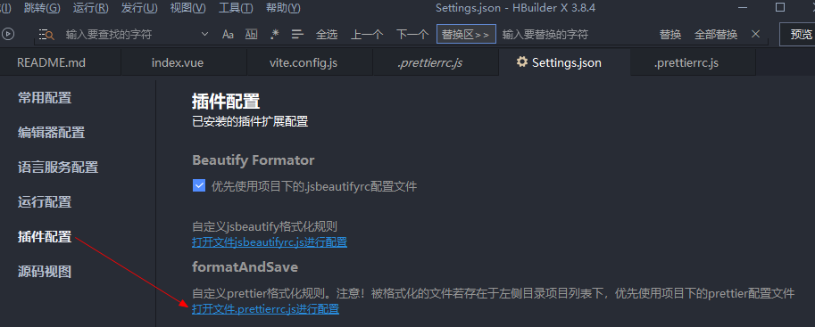
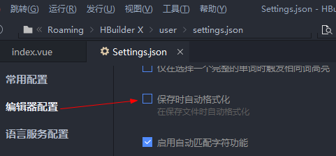
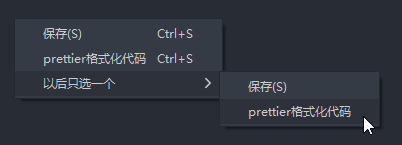
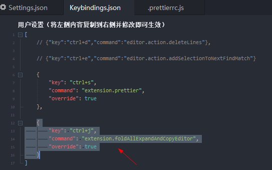
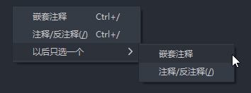

# 代码格式化

- https://github.com/zqy233/formatAndSave
- https://zqy233.github.io/formatAndSave/

### 一、导入插件

https://ext.dcloud.net.cn/plugin?id=7695

点击右侧使用HBuilderX导入插件按钮，插件会导入到 HBuilderX 中

`HBuilderX` -> `工具` -> `设置` -> `插件配置` 中可以看到相关插件

> tips: 在这里可以配置每次默认生成的 `.prettierrc.js` 内容

### 二、设置以后只选一个为prettier格式化代码

`HBuilderX` -> `工具` -> `设置` -> `编辑器设置` 中取消勾选保存时自动格式化，避免和官方格式化冲突

在文件中按下 Ctrl+S 会触发，并且会在项目目录下自动生成配置文件

1. [.prettierrc.js](../../.prettierrc.js)
2. [.prettierignore](../../.prettierignore)

### 三、vue 文件双分栏 快捷键配置

`HBuilderX` -> `工具` -> `自定义快捷键`

配置后在vue文件中 ctrl+j 即可快速分栏

### 四、嵌套注释

在任意文件中按下`ctrl+/`会出现选择菜单，设置以后只选一个为嵌套注释

