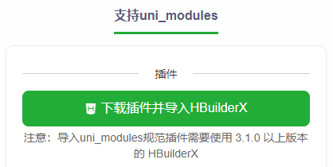

# 引入ui组件

可选的一些ui组件

- [uView](https://www.uviewui.com)
- [First UI](https://doc.firstui.cn)
- [uview-plus](https://uiadmin.net/uview-plus/)
- [vk-uview-ui](https://ext.dcloud.net.cn/plugin?name=vk-uview-ui)
- [uv-ui](https://ext.dcloud.net.cn/plugin?id=12287)
- [Vant](https://github.com/youzan/vant)
- [ThorUI](https://github.com/dingyong0214/ThorUI-uniapp)
- [TDesign](https://github.com/Tencent/tdesign)
- [ColorUI](https://github.com/weilanwl/coloruicss)
- [tmui.design](https://gitee.com/LYTB/tmui-design)
- [uni-ui](https://uniapp.dcloud.net.cn/component/uniui/uni-ui.html)

### 安装`uni-ui`

通过 `uni_modules` 导入全部组件 https://ext.dcloud.net.cn/plugin?id=55



然后就可以直接使用了...

### 安装`uview-plus`

NPM安装 https://uiadmin.net/uview-plus/components/npmSetting.html

```shell
cnpm install sass sass-loader@10 -D
cnpm install uview-plus dayjs clipboard
```

配置见官方文档

- [main.js](../../src/main.js)
- [uni.scss](../../src/uni.scss)
- [App.vue](../../src/App.vue)
