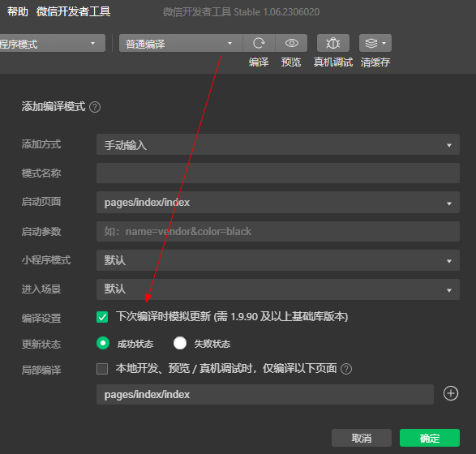
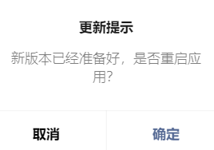

# 小程序更新

1. 冷更新：用户首次打开，或小程序被删除后搜索再次打开
2. 热更新：用户已经打开过小程序，但小程序未被销毁，`onShow`显示页面时监测更新，如果有就选择性更新或强制更新等操作

### 一、编写代码开启自动更新

[App.vue](../../src/App.vue)

```
<script setup>
import { onLaunch, onShow, onHide } from '@dcloudio/uni-app';

onShow(() => {
    // #ifdef MP-WEIXIN
    getUpdateManager();
    // #endif
});

// 小程序更新 https://uniapp.dcloud.net.cn/api/other/update.html
function getUpdateManager() {
    const updateManager = uni.getUpdateManager();

    // 请求完新版本信息时回调 res: {hasUpdate: true}
    updateManager.onCheckForUpdate(function (res) {
        if (res.hasUpdate) {
            // 有更新
            // uni.showLoading({ title: '更新中...' });
        }
    });

    // 新版本下载完成时回调
    updateManager.onUpdateReady(function () {
        // uni.hideLoading(); // 关闭 Loading
        uni.showModal({
            // 弹确认框（强制更新）
            title: '更新提示',
            content: '新版本已经准备好，是否重启应用？',
            success: function (res) {
                if (res.confirm) {
                    // 新的版本已经下载好，调用 applyUpdate 应用新版本并重启
                    updateManager.applyUpdate();
                }
            },
        });
    });

    // 新版本下载失败时回调
    updateManager.onUpdateFailed(function () {
        // uni.hideLoading(); // 关闭 Loading
        uni.showModal({
            title: '更新提示',
            content:
                '检查到有新版本，但由于网络原因等下载失败，请您删除当前小程序后重新搜索打开哟~',
            confirmText: '好的',
            showCancel: false,
        });
    });
}
</script>
```

### 二、开发环境调试

`微信开发者工具` -> `编译模式` -> `下次编译时模拟更新` 开关进行调试

> tips: 小程序 `开发版/体验版` 没有版本概念，无法测试更新




