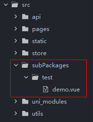

# 分包

- subPackages 分包配置 https://uniapp.dcloud.net.cn/collocation/pages.html#subpackages
- preloadRule 分包预载配置 https://uniapp.dcloud.net.cn/collocation/pages.html#preloadrule

目的：主包太大，小程序无法正常加载，因此需要拆分。

微信小程序每个分包的大小是2M，总体积一共不能超过20M。

### 一、新建分包页面

`subPackages/test/demo.vue`



```
<template>
    <view>hello</view>
</template>
```

### 二、分包配置

[pages.json](../../src/pages.json)

```
// 分包配置 https://uniapp.dcloud.net.cn/collocation/pages.html#subpackages
"subPackages": [
    {
        "root": "subPackages/test",
        "pages": [
            {
                "path": "demo",
                "style": {
                    "navigationBarTitleText": "测试分包",
                    "enablePullDownRefresh": false
                }
            }
        ]
    }
],
```

### 三、分包预载配置

[pages.json](../../src/pages.json)

```
// 分包预载配置 https://uniapp.dcloud.net.cn/collocation/pages.html#preloadrule
"preloadRule": {
    // 在进入小程序某个页面时，由框架自动预下载可能需要的分包，提升进入后续分包页面时的启动速度
    "pages/index/index": {
        "network": "all", // 在指定网络下预下载，可选值为：all（不限网络）、wifi（仅wifi下预下载）
        "packages": ["subPackages/test"] // 进入页面后预下载分包的 root 或 name。__APP__ 表示主包。
    }
},
```

### 四、测试：主包页面跳转到分包页面中

```
<navigator :url="'/subPackages/test/demo'">
    <up-button text="测试跳转" />
</navigator>
```


