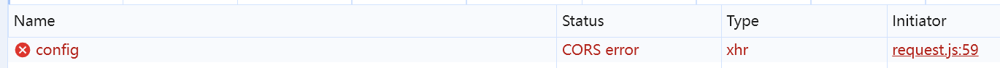
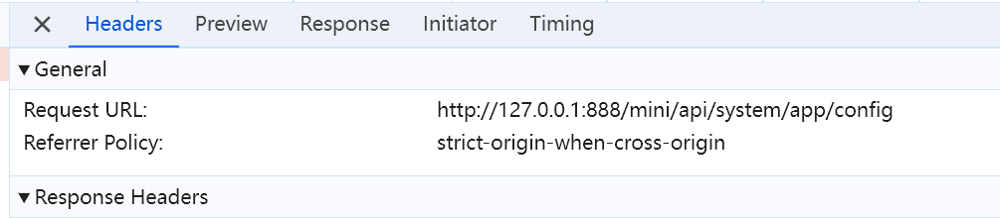

# 解决外部浏览器跨域问题

### 问题

通过Hbuilder在内置浏览器中运行请求接口正常，但通过外部浏览器访问存在跨域问题



### 解决

接口请求配置：[config.js](../../src/config.js)

```js
// 解决外部浏览器跨域问题
const local_dev_api = {
  baseUrl: '/dev-api',
};

export default local_dev_api;
```

配置代理：[vite.config.js](../../vite.config.js)

```js
export default defineConfig({
  // 反向代理解决跨域问题
  server: {
    proxy: {
      '/dev-api': {
        target: 'http://127.0.0.1:888', // 目标接口
        changeOrigin: true, // 是否换源
        secure: true, // 设置支持https协议的代理
        rewrite: (path) => path.replace(new RegExp('^/dev-api'), ''), // 匹配接口进行转发
      },
    },
  },
});
```

---

通过以上配置后，在请求`/dev-api/mini/api/system/app/config` 接口时就会转发请求 `http://127.0.0.1:888/mini/api/system/app/config`

注：接口请求域名为`/dev-api`，不能是真实的`http://127.0.0.1:888`，因为`rewrite`会匹配请求前缀进行转发。

```js
uni.request({ 
    url:"/dev-api/mini/api/system/app/config"
}).then(res => {
	console.log(res);
})
```


### 其它

网上说的在 `manifest.json` 中配置如下，经个人测试，无效。

```
{
  "h5": {
    "sdkConfigs": {
      "maps": {}
    },
    "title": "h5应用",
    "template": "",
    "router": {
      "mode": "history",
      "base": "/h5/"
    },
    "devServer": {
      "port": 5100,
      // 跨域解决 -- 下面配置无效
      "https": false,
      "disableHostCheck": true,
      "proxy": {
        "/dev-api": {
          "target": "http://127.0.0.1:888", // 目标接口
          "changeOrigin": true, // 是否换源
          "secure": true, // 设置支持https协议的代理
          "pathRewrite": {
            "^/api": ""  // 匹配接口进行转发
          }
        }
      }
    }
  }
}
```