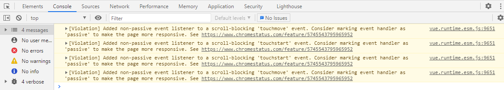

### 问题

```
[Violation] Added non-passive event listener to a scroll-blocking 'touchmove' event. Consider marking event handler as 'passive' to make the page more responsive. See https://www.chromestatus.com/feature/5745543795965952
[Violation] Added non-passive event listener to a scroll-blocking 'touchstart' event. Consider marking event handler as 'passive' to make the page more responsive. See https://www.chromestatus.com/feature/5745543795965952
```



点击链接查看：
在 EventListenerOptions 字典中公开“passive”布尔值。
实现与分派被动 EventListener 相关的行为，以便在执行被动注册回调时调用 PreventDefault 仅向控制台生成警告。
可用于显着提高滚动性能。

### 解决

```shell
cnpm install default-passive-events -S 
```

`main.js`

```
import 'default-passive-events'
```