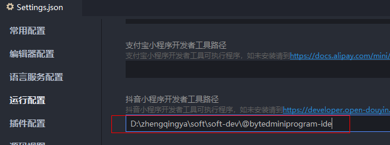
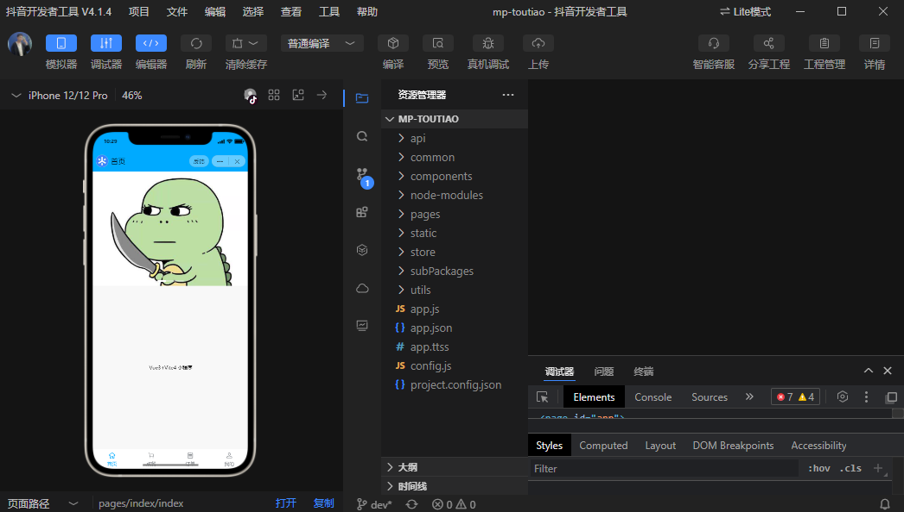

# 抖音小程序开发

https://developer.open-douyin.com/docs/resource/zh-CN/mini-app/develop/guide/quick-start/overview

### 开发者工具

https://developer.open-douyin.com/docs/resource/zh-CN/mini-app/develop/developer-instrument/download/developer-instrument-update-and-download

### uniapp 运行

配置 抖音小程序开发者工具路径

然后就可以查看了

