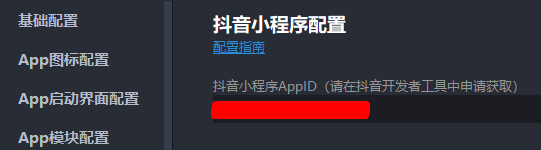

# 登录

### 一、前端授权

配置抖音小程序appid


发起授权请求

#### 静默登录

```
uni.getProvider({
  service: 'oauth',
  success: function (providerRes) {
    console.log('设备可登录的平台：', providerRes.provider);
    uni.login({
      provider: 'toutiao',
      success: async (loginRes) => {
        console.log(loginRes);
        // 请求后台获取openid注册登录成功后返回基本用户信息
      },
    });
  },
});
```

#### 用户手动授权登录

`uni.getUserInfo` 为匿名用户数据，建议使用 `uni.getUserProfile` 获取用户信息

```
<u-button type="success"  style="width: 200rpx; margin-top: 60rpx" size="small" withCredentials="true" data-eventsync="true" @tap="login" text="授权登录" />
        
async function login() {
    uni.getUserProfile({
      success: async (userRes) => {
        console.log('用户信息：', userRes);
        uni.login({
          provider: 'toutiao',
          success: async (loginRes) => {
            // console.log(loginRes);
            // 请求后台获取openid注册登录成功后返回基本用户信息
          },
        });
      },
      fail: (err) => {
        console.log('授权失败：', err);
      },
    });
}
```

### 二、后端登录 code2Session（拿到openid）

https://developer.open-douyin.com/docs/resource/zh-CN/mini-app/develop/server/log-in/code-2-session

```
String body = HttpUtil.createPost("https://open-sandbox.douyin.com/api/apps/v2/jscode2session").body(
                JSONUtil.toJsonStr(new HashMap<String, Object>() {{
                    this.put("appid", "xxx");
                    this.put("secret", "xxx");
                    this.put("code", "xxx");
                    this.put("anonymous_code", "xxx");
                }})
        )
        .execute().body();
System.out.println(body); // {"err_no":0,"err_tips":"success","data":{"session_key":"xxx==","openid":"xx","anonymous_openid":"xx","unionid":"xx","dopenid":""}}
```
