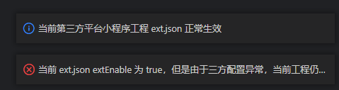
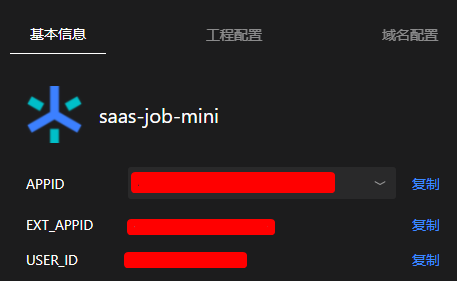

# ext.json

> https://partner.open-douyin.com/docs/resource/zh-CN/thirdparty/overview-guide/smallprogram/DevelopingCode

`抖音开发者工具` -> `工具` -> `第三方平台小程序检测` 查看配置是否生效



> tips: 不要有注释啥的，不然不生效...


```json
{
  "extEnable": true,
  "extAppid": "xxx",
  "directCommit": true,
  "extPages": {
    "pages/index/index": {
      "navigationBarTitleText": "自定义首页"
    }
  },
  "ext": {
    "tenant_id": 10
  }
}
```

详情中也可以看到相应的 `EXT_APPID` 字段信息


