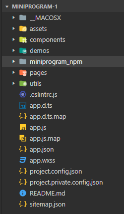

# 项目结构

- `pages` 页面
- `utils` 工具类
- `app.js` 入口文件
- `app.json` 全局配置文件
- `app.wxss` 全局样式文件
- `project.config.json` 项目配置文件
- `sitemap.json` 配置小程序及其页面是否允许被微信索引

`pages` 目录下存放每一个页面

- `.js` 处理数据
- `.json` 配置文件，配置窗口的外观、表现等
- `.wxml` 页面结构
- `.wxss` 页面样式
