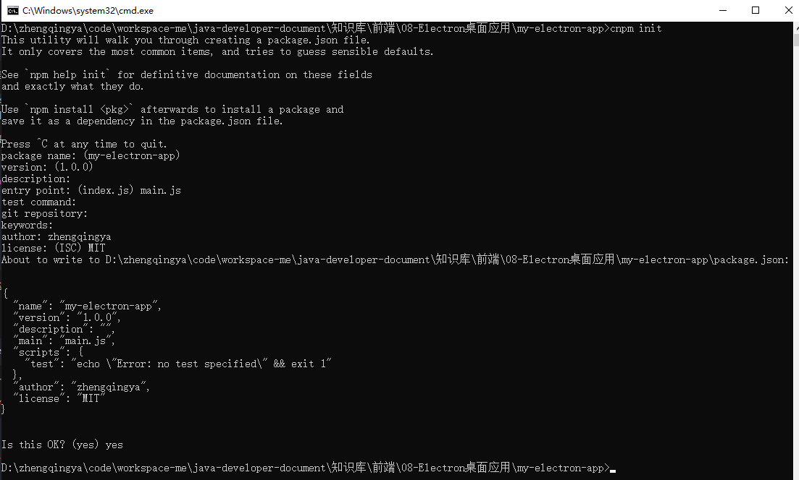
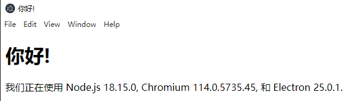
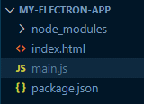

# 快速入门 0-1

> https://www.electronjs.org/zh/docs/latest/tutorial/quick-start

通过使用Electron创建一个极简的 Hello World 应用

> tips: 该应用与 electron-quick-start 类似

### 1、初始化项目

```shell
mkdir my-electron-app && cd my-electron-app
cnpm init
cnpm install --save-dev electron
```



### 2、`package.json`中配置 start 命令运行

```json
{
  "scripts": {
    "start": "electron ."
  }
}
```

### 3、新建`preload.js`

```js
window.addEventListener("DOMContentLoaded", () => {
  const replaceText = (selector, text) => {
    const element = document.getElementById(selector);
    if (element) element.innerText = text;
  };

  for (const dependency of ["chrome", "node", "electron"]) {
    replaceText(`${dependency}-version`, process.versions[dependency]);
  }
});
```

### 4、新建`index.html`

```html
<!DOCTYPE html>
<html>
<head>
    <meta charset="UTF-8"/>
    <!-- https://developer.mozilla.org/zh-CN/docs/Web/HTTP/CSP -->
    <meta
            http-equiv="Content-Security-Policy"
            content="default-src 'self'; script-src 'self'"
    />
    <title>你好!</title>
</head>

<body>
<h1>你好!</h1>
我们正在使用 Node.js <span id="node-version"></span>, Chromium
<span id="chrome-version"></span>, 和 Electron
<span id="electron-version"></span>.

<script src="./renderer.js"></script>
</body>
</html>
```

### 5、新建`main.js`

```
const { app, BrowserWindow } = require("electron");

const path = require("path");

const createWindow = () => {
  const win = new BrowserWindow({
    width: 800,
    height: 600,
    webPreferences: {
      preload: path.join(__dirname, "preload.js"),
    },
  });

  win.loadFile("index.html");
};

app.whenReady().then(() => {
  createWindow();

  app.on("activate", () => {
    if (BrowserWindow.getAllWindows().length === 0) createWindow();
  });
});

app.on("window-all-closed", () => {
  console.log("window-all-closed");
  if (process.platform !== "darwin") app.quit();
});
```

### 6、运行

```shell
cnpm start
```



目前项目结构


