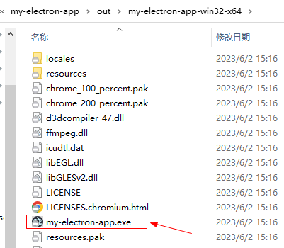

# 打包并分发您的应用程序

通过[`Electron Forge`](https://www.electronforge.io/)

### 1、在项目中添加依赖

```shell
# 添加依赖之前一定要执行这条命令 =》改源 ,不然下面安装依赖时会报错 ( 不要直接使用cnpm安装哦... )
npm config set ELECTRON_MIRROR http://npmmirror.com/mirrors/electron/

npm install --save-dev @electron-forge/cli
npx electron-forge import
```

### 2、使用 Forge 的 make 命令来创建可分发的应用程序

```shell
npm run make
```

打包成功后生成`my-electron-app\out\my-electron-app-win32-x64\my-electron-app.exe`


