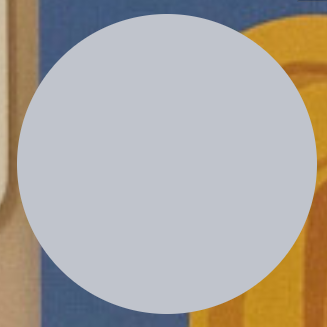

# 去掉标题栏&整体可拖动&透明

```js
const mainWindow = new BrowserWindow({
    width: 500,
    height: 370,
    show: false,
    autoHideMenuBar: true,
    ...(process.platform === 'linux' ? { icon } : {}),
    webPreferences: {
      preload: join(__dirname, '../preload/index.js'),
      sandbox: false
    },


    transparent: true, // 透明
    frame: false, // 去除边框
    devTools: false
})
```

```css
body {
  background:#ffffff00;    /* 背景透明 */
  -webkit-app-region: drag;  /* 可拖拽 */
}
```


