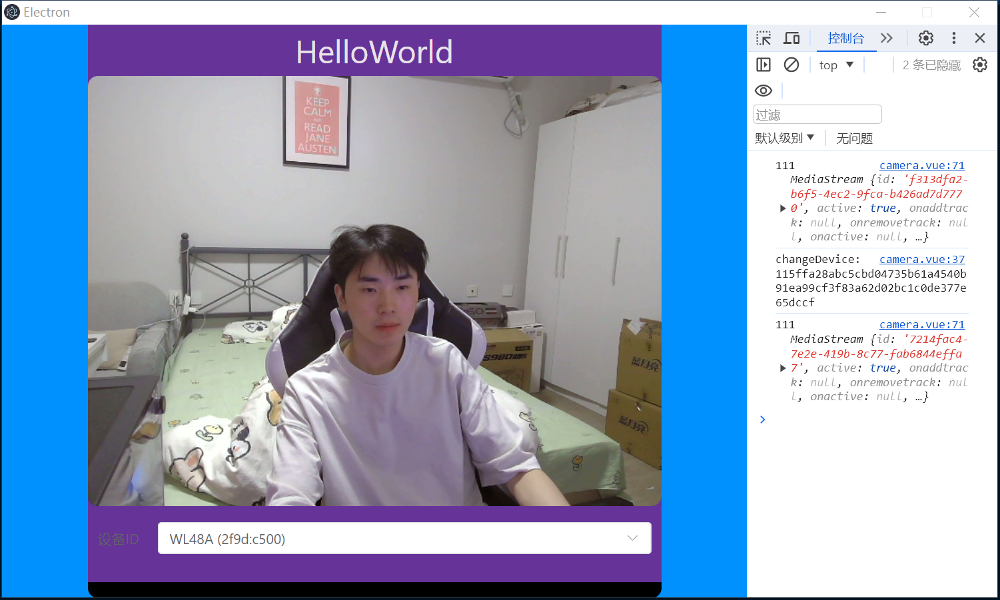

# 摄像头开发

`src/main/index.js`

```
function createWindow() {
  // Create the browser window.
  const mainWindow = new BrowserWindow({
    width: 1000,
    height: 600,
    show: false,
    autoHideMenuBar: true, // 隐藏菜单栏
    ...(process.platform === 'linux' ? { icon } : {}),
    webPreferences: {
      preload: join(__dirname, '../preload/index.js'),
      sandbox: false,
      nodeIntegration: true // 允许在渲染进程中使用Node.js
    },
    transparent: true, // 透明
    // frame: false, // 去除边框
    devTools: false,
    alwaysOnTop: true, // 窗口置顶
    // allowMediaDevices: true // 允许访问摄像头和麦克风
  })

  // 开发环境 -- 右侧打开调试工具
  if (is.dev) mainWindow.webContents.openDevTools({ mode: 'right' })
  
}  
```

`src/renderer/src/components/camera.vue`

```
<template>
  <div class="flex-center" style="background-color: rebeccapurple">
    <h1>HelloWorld</h1>

    <div>
      <video style="width: 100%; height: 100%; border-radius: 10px; background-color: blue"></video>
    </div>

    <div style="padding: 10px; width: 100%; height: 100%">
      <el-form label-position="left" :model="config" label-width="60px">
        <el-form-item label="设备ID">
          <el-select v-model="config.deviceId" placeholder="请选择摄像头" @change="changeDevice">
            <el-option
              v-for="item in cameraList"
              :key="item.deviceId"
              :label="item.label"
              :value="item.deviceId"
            ></el-option>
          </el-select>
        </el-form-item>
      </el-form>
    </div>
  </div>
</template>

<script setup>
import { onMounted, ref } from 'vue'

let config = ref({})

onMounted(() => {
  getCameraList()
  show()
})

function changeDevice(val) {
  console.log('changeDevice:', val)
  show()
}

// 获取摄像头列表
let cameraList = ref([])
async function getCameraList() {
  // 1.获取系统的所有音频设备
  const deviceList = await navigator.mediaDevices.enumerateDevices()
  // console.log('devices:', deviceList)

  // 2.从音频设备中过滤出摄像头
  cameraList.value = deviceList.filter((d) => d.kind.includes('video'))
  // console.log('cameras:', cameraList)
}

// 打开摄像头
function show() {
  if (!config.value.deviceId) {
    // return
  }
  const video = document.querySelector('video')

  // 拿到指定媒体设备 https://developer.mozilla.org/zh-CN/docs/Web/API/MediaDevices/getUserMedia
  navigator.mediaDevices
    .getUserMedia({
      audio: false, // 设置这个摄像头不捕获声音
      video: {
        deviceId: config.value.deviceId // 设置摄像头设备ID
        // width: 1920,
        // height: 1080
      }
    })
    .then(function (stream) {
      console.log('111', stream)
      video.srcObject = stream
      video.play()
    })
}
</script>

<style lang="scss" scoped>
.flex-center {
  display: flex;
  align-items: center;
  justify-content: center;
  flex-direction: column;
}
</style>
```

效果:

